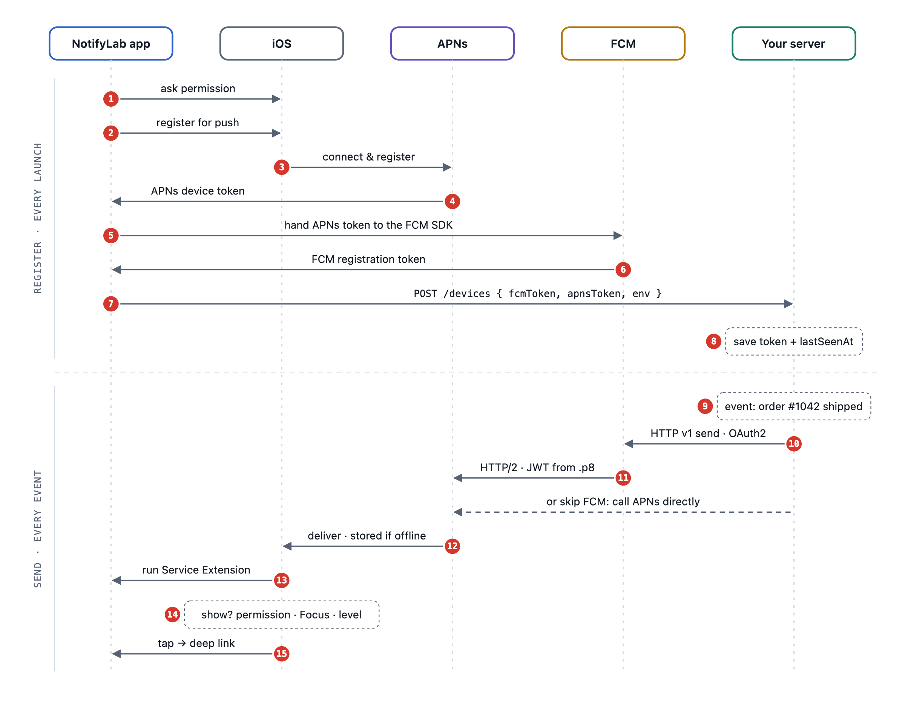
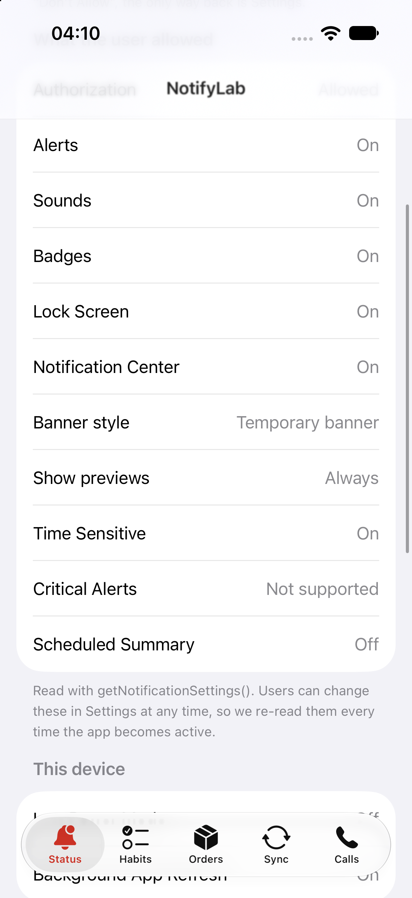

# iOS Notifications, End to End — Part 0: Which Notification Do You Need?

*A map of every notification an iOS app ships: habit reminders, order updates, silent syncs, VoIP calls, rich notifications and messages that show the sender's face. Plus the one demo app we'll build across this series.*

---

If you asked me for the most common notification problem you'll run into, I'd say it's this one: **the notification never shows up.**

The idea for this series came from [a YouTube video](https://www.youtube.com/watch?v=aXbnjpnnBjA&t=2625s). Two iOS developers, [Ahmed Menaim](https://www.linkedin.com/in/menaim/) (senior iOS developer) and [Mostafa Nafie](https://www.linkedin.com/in/mostafanafie/) (staff iOS engineer, [nafie.dev](https://www.nafie.dev)), sat down for a podcast-style talk about notifications and went deep into the details. It inspired me to do the same in writing: document everything, as a way to learn it properly and to share what I learned.

This series is the guide I wish I'd had: every notification type on iOS, the setup behind it, how it actually travels from your server to the screen, and what quietly stops it on the way. Each part ends with something you can run.

This first part is the map.

## The six kinds of notification

![Table of the six kinds of iOS notification. Local: the app schedules it, needs permission to show anything, wakes your code only when tapped, e.g. a habit reminder. Remote alert: your server to APNs, often via FCM, needs full or provisional permission, a Service Extension can edit it first, e.g. "Order shipped". Background (silent): no permission, wakes the app for about 30 seconds, best-effort, e.g. refresh the inbox. VoIP: through PushKit, no permission, wakes the app even if killed and must show a call. Rich: any alert, edited by a Service Extension and shown by a Content Extension, e.g. a product photo. Communication: a remote alert sent by a person, the Service Extension donates a message intent, shows the sender's photo and can break through Focus.](tables/p0-kinds.png)
*The six kinds of notification, side by side.*

Three things surprise people in this table:

1. **A remote push is not one thing.** The same pipe (APNs) carries an alert, a silent wake-up, and a VoIP call. They behave completely differently, and one HTTP header, `apns-push-type`, says which one you're sending. (A VoIP call also needs its own token.)
2. **"Rich" and "communication" aren't separate kinds of push.** Both are ordinary alerts with `mutable-content: 1`. Your Service Extension adds a photo to the first, and turns the second into a message from a person, with their face where your app icon would be.
3. **Some notifications need no permission at all.**

> **"Can I send notifications without asking for permission?"** Yes, in three honest ways.

- **Provisional authorization** (iOS 12+) shows no prompt and delivers quietly to Notification Center with *Keep* and *Turn Off* buttons.
- **Background pushes** need no permission because they show nothing.
- **VoIP pushes** need no permission, but every one must show the system call screen.

And you can always get a device token without permission. Asking and registering are two separate calls.

## How a remote push travels, from start to end

*Figure 2: two loops, not one pipe.*

Most tutorials draw this as a straight line: server → Apple → phone. In production it's **two loops**.

**Loop 1: Register (every launch).**
The app calls `registerForRemoteNotifications()`. iOS talks to APNs and hands you a **device token**. (Asking for permission is a separate step. It decides what the user sees, not whether you get a token.) If you use Firebase, you pass that token to the FCM SDK and get an **FCM token** back. Both go to your server, which saves them with a `lastSeenAt` timestamp.

**Loop 2: Send (every event).**
Something happens: *order #1042 shipped*. Your server sends to FCM (HTTP v1), and FCM calls APNs with the key you uploaded. Or your server calls APNs directly. APNs delivers to the device, or keeps it if the device is offline, **but only the newest one per app**. iOS runs your Service Extension, then decides whether to show it at all, based on permission, Focus and the interruption level. When the user taps, your app routes to the right screen.

Every bug report you'll ever get lives somewhere on that picture. Part 7 walks through it gate by gate.

## What we'll build: NotifyLab

*NotifyLab's Status tab. The five tabs sit at the bottom.*

One SwiftUI app, five tabs, each a real product scenario:

![Table of NotifyLab's five tabs. Status: what the user allowed, Low Power Mode and a live event log (Parts 1 and 7). Habits: a habit tracker with Done and Snooze buttons under the 64-notification limit (Part 1). Orders: order updates by push, deep links, an image in the banner, a custom card on long-press and a message from your driver that shows their photo (Parts 3 to 5). Sync: silent pushes that update data in the background (Part 4). Calls: a VoIP push that rings the phone through CallKit (Part 6).](tables/p0-tabs.png)
*NotifyLab's five tabs, and the part that covers each.*

It comes with a test kit, so every part ends with *"now run this"*:

- `payloads/*.apns`: drag them onto the Simulator, or run `xcrun simctl push`.
- `tools/apns.sh`: the exact curl request your server would make.
- `tools/fcm.mjs`: the same thing through Firebase HTTP v1.
- `tools/registry-server.mjs`: a 100-line token server that deletes dead tokens.
- A Postman collection, and the Push Notifications Console walkthrough.

**The code is on GitHub: [github.com/Sa3doola/NotifyLab](https://github.com/Sa3doola/NotifyLab).** Clone it, open `NotifyLab.xcodeproj` and run it on any iOS 17+ Simulator. You don't need an Apple Developer account until Part 2.

## The series

![Table of the series. Part 0: Which notification do you need? Part 1: Ask well, remind well, habit reminders with actions. Part 2: Wiring up push, App ID, capabilities, entitlements and the .p8 key. Part 3: Device tokens and FCM. Part 4: Sending order updates, marketing and silent syncs. Part 5: Rich and communication notifications, a Service Extension for images and messages with the sender's photo, and a Content Extension for custom UI. Part 6: VoIP with PushKit and CallKit. Part 7: Real-world delivery, Focus, Low Power Mode, interruption levels and test tools. Appendix: a cheat sheet of limits, headers and error codes.](tables/p0-series.png)
*The series at a glance.*

The repo holds the finished app. Each part names the files it covers, so you can read the real code next to the article.

**Next: Part 1, Ask well, remind well.** We'll ask for permission at the moment it makes sense, schedule habit reminders that respect the 64-notification limit, and add Done and Snooze buttons that work without opening the app.
