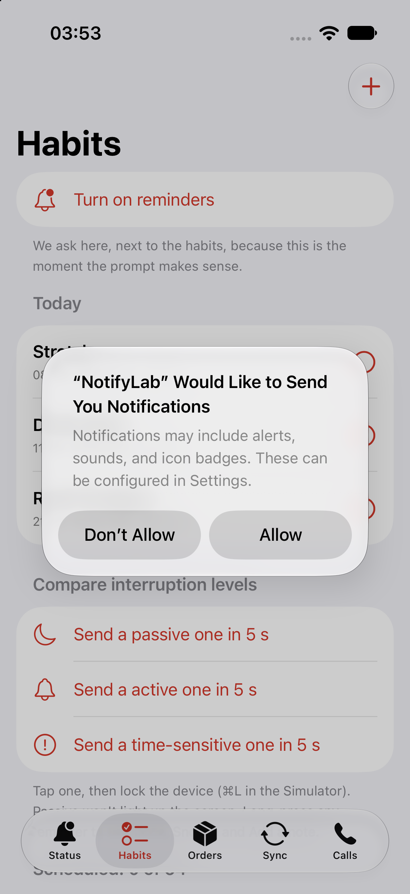
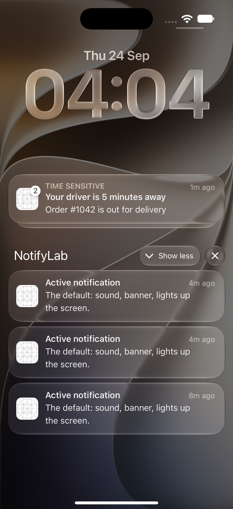
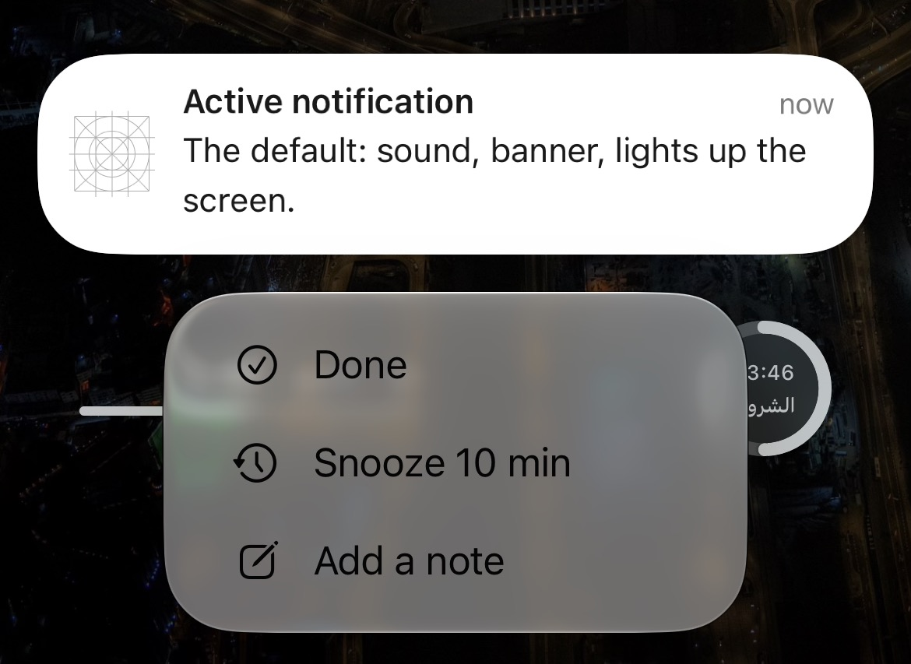

# iOS Notifications, End to End — Part 1: Ask Well, Remind Well

*Permission, provisional authorization, and local notifications for a habit tracker: Done and Snooze buttons, the 64-notification limit, and interruption levels.*

---

*This is Part 1 of [iOS Notifications, End to End](https://medium.com/@saadsherif02/ios-notifications-end-to-end-part-0-which-notification-do-you-need-cf3057ad7b9e). New to the series? Start with Part 0, the map.*

Local notifications are the best place to start. They need no server, no Apple Developer account and no certificates. They still teach you most of what you'll use later: permission, categories, actions, the delegate, and how iOS decides what's worth interrupting someone for.

We're building the **Habits** tab of NotifyLab. By the end you'll have:

- A permission prompt shown at the moment it makes sense, not at launch
- Daily reminders that stay under iOS's hidden limit of 64
- **Done**, **Snooze 10 min** and **Add a note** buttons that work without opening the app
- Three test buttons that show the difference between *passive*, *active* and *time-sensitive*



> Code: `HabitScheduler.swift`, `NotificationCategories.swift` and `NotificationRouter.swift` in the [NotifyLab repo](https://github.com/Sa3doola/NotifyLab). Everything below runs in the Simulator.

---

## The anatomy of a local notification

A local notification is three objects handed to one center:

```
UNMutableNotificationContent   what it says: title, body, sound, category, interruption level
+ UNNotificationTrigger        when: after N seconds, at a calendar date, or at a location
= UNNotificationRequest        with an identifier you choose
→ UNUserNotificationCenter.add(request)
```

The **identifier** matters more than it looks. Adding a request with an existing identifier **replaces** it. That's how you update or cancel a reminder later, so make identifiers stable and meaningful (`habit.<id>.2026-09-24`), not random.

---

## Step 1: Ask at the right moment

iOS shows the permission prompt **once**. If the user taps *Don't Allow*, the only way back is the Settings app. So the prompt is the most valuable screen in your notification setup. Don't spend it at launch, before the user knows why you're asking.

In NotifyLab, the Habits tab shows a *"Turn on reminders"* row next to the habits themselves. That's the moment the prompt makes sense:

```swift
@MainActor @Observable
final class NotificationPermission {
    private(set) var status: UNAuthorizationStatus = .notDetermined
    private let center = UNUserNotificationCenter.current()

    @discardableResult
    func requestFull() async -> Bool {
        let granted = (try? await center.requestAuthorization(options: [.alert, .sound, .badge])) ?? false
        await refresh()
        return granted
    }

    func refresh() async {
        let settings = await center.notificationSettings()
        status = settings.authorizationStatus
        // …plus alertSetting, lockScreenSetting, timeSensitiveSetting, scheduledDeliverySetting…
    }
}
```

Two rules that save you bug reports:

- **Re-read the settings every time the app becomes active.** Users change them in Settings at any time. NotifyLab calls `refresh()` from `scenePhase == .active`.
- **After a denial, don't nag. Deep-link instead:**

```swift
if let url = URL(string: UIApplication.openNotificationSettingsURLString) {
    UIApplication.shared.open(url)   // opens *your app's* notification settings (iOS 16+)
}
```

On my iPhone this opens NotifyLab's own notification page. On the iOS 27 Simulator it opened the main Settings page instead, so check this one on a device.

## Step 2: Or don't ask at all (provisional authorization)

Add `.provisional` and iOS **skips the prompt entirely**:

```swift
try await center.requestAuthorization(options: [.alert, .sound, .badge, .provisional])
```

Your notifications then arrive *quietly*: no banner, no sound, no lock screen. They go straight to Notification Center, with two buttons: **Keep** and **Turn Off**. The user decides after seeing real value, not a hypothetical one.

`authorizationStatus` becomes `.provisional`. You can still ask for full permission later; NotifyLab's Status tab shows *"Ask for permission"* while the status is provisional.

**When to use it:** apps where the first notification proves its own worth, like a weekly summary or a "your report is ready". **When not to:** anything time-critical, because a quiet notification is an easily missed one.

## Step 3: Register the buttons (categories and actions)

Buttons belong to a **category**. You register categories once, at launch, before any notification can arrive:

```swift
enum NotificationCategories {
    static func register() {
        let done = UNNotificationAction(
            identifier: ActionID.habitDone, title: "Done",
            options: [], icon: UNNotificationActionIcon(systemImageName: "checkmark.circle"))
        let snooze = UNNotificationAction(
            identifier: ActionID.habitSnooze, title: "Snooze 10 min",
            options: [], icon: UNNotificationActionIcon(systemImageName: "clock.arrow.circlepath"))
        let note = UNTextInputNotificationAction(
            identifier: ActionID.habitNote, title: "Add a note",
            options: [], icon: UNNotificationActionIcon(systemImageName: "square.and.pencil"),
            textInputButtonTitle: "Save", textInputPlaceholder: "How did it go?")

        let habit = UNNotificationCategory(
            identifier: CategoryID.habit,
            actions: [done, snooze, note],
            intentIdentifiers: [],
            options: [.customDismissAction])   // also tell us when it's swiped away

        UNUserNotificationCenter.current().setNotificationCategories([habit /*, order, message */])
    }
}
```

- `options: []` means the action runs **in the background**. The app wakes briefly and the notification closes, but the app doesn't open. Use `.foreground` when the action needs the UI (like "Track order" in Part 5).
- A notification picks its buttons with `content.categoryIdentifier = "HABIT"`. For remote pushes, it's `"category": "HABIT"` in the payload. Same buttons, same handler.

## Step 4: Schedule a reminder

```swift
let content = UNMutableNotificationContent()
content.title = habit.name
content.body = "Keep your \(streak)-day streak going."
content.sound = .default
content.categoryIdentifier = CategoryID.habit          // Done / Snooze / Note
content.threadIdentifier = "habit-\(habit.id)"         // groups this habit's reminders
content.interruptionLevel = .active                    // more in Step 7
content.userInfo = ["habitId": habit.id.uuidString]    // for the handler

let parts = Calendar.current.dateComponents([.year, .month, .day, .hour, .minute], from: fireDate)
let trigger = UNCalendarNotificationTrigger(dateMatching: parts, repeats: false)
let request = UNNotificationRequest(identifier: "habit.\(habit.id).\(dayKey)", content: content, trigger: trigger)

try await UNUserNotificationCenter.current().add(request)
```

The tempting shortcut is one repeating trigger per habit:

```swift
UNCalendarNotificationTrigger(dateMatching: DateComponents(hour: 8, minute: 0), repeats: true)
```

It works in a demo. In a real habit app it has one fatal flaw: a repeating trigger can't skip a day. The user ticks "Stretch" at 7:40, and the 8:00 reminder still fires. That's how you teach people to ignore your notifications.

## Step 5: The limit nobody mentions, 64

The fix is one request per day, so you can remove today's when the habit is done. That runs straight into a limit: iOS keeps **at most 64 pending local notifications per app**. It keeps the 64 that fire soonest and **silently drops the rest**, with no error. Five daily habits, two weeks ahead, is already 70.

NotifyLab uses a **rolling window**:

> Every time the app runs, schedule the next occurrences of every habit (up to 14 days ahead, capped at 60 requests), soonest first. Skip today's reminder if the habit is already done.

```swift
func replan() async {
    // 1. Remove what we scheduled last time
    let old = await center.pendingNotificationRequests()
        .map(\.identifier)
        .filter { $0.hasPrefix("habit.") && !$0.hasSuffix(".snooze") }
    center.removePendingNotificationRequests(withIdentifiers: old)

    // 2. Next occurrences, soonest first, within budget (60 of 64: 4 left for snoozes & tests)
    let upcoming = upcomingOccurrences().sorted { $0.date < $1.date }
    let planned = upcoming.prefix(60)
    droppedCount = upcoming.count - planned.count

    // 3. Schedule
    for occurrence in planned {
        try? await center.add(request(for: occurrence.habit, at: occurrence.date))
    }
}
```

`replan()` runs on every launch and every time the app becomes active, and whenever a habit is added, deleted or marked done. With the three demo habits it schedules up to **38 of 64** (two weeks of three habits, one of them weekdays only), and the Habits tab shows the count.

**The trade-off, stated honestly:** if the user doesn't open the app for 14 days, reminders stop. For a habit app that's arguably correct. If it isn't for yours, make the last scheduled reminder say so ("Open NotifyLab to keep your reminders coming"), or top up the window from a background task.

When the user marks a habit done, we also clean up what's already on screen:

```swift
let delivered = await center.deliveredNotifications()
    .map(\.request.identifier)
    .filter { $0.hasPrefix("habit.\(habitID)") }
center.removeDeliveredNotifications(withIdentifiers: delivered)
```

## Step 6: Handle taps and buttons (the delegate)

One object answers two questions for **every** notification, local or remote:

- **"The app is open. Should I show this?"** → `willPresent`
- **"The user tapped it or a button. What now?"** → `didReceive`

Set it **before** `application(_:didFinishLaunchingWithOptions:)` returns. Otherwise the tap that *launched* the app is lost:

```swift
func application(_ application: UIApplication,
                 didFinishLaunchingWithOptions launchOptions: [UIApplication.LaunchOptionsKey: Any]? = nil) -> Bool {
    UNUserNotificationCenter.current().delegate = model.router
    NotificationCategories.register()
    // …
    return true
}
```

In a SwiftUI app, that's what `@UIApplicationDelegateAdaptor(AppDelegate.self)` is for.

### The Swift 6 detail (and the crash I shipped in my first draft)

When you write the `async` versions of these delegate methods, iOS still passes a hidden completion handler, and **Swift calls it for you** when your method returns. iOS requires that call on the **main thread**.

My first draft marked the methods `nonisolated`. It compiled with zero warnings, and willPresent even worked. Then tapping **Call driver** on a real iPhone crashed:

```
Task 66: "Call must be made on main thread"
```

A `nonisolated async` method finishes on a background executor, so Swift called iOS's completion handler from there. The fix is one word in the right place: make the **conformance** main-actor-isolated (Swift 6.2+), so both methods run and finish on the main actor:

```swift
extension NotificationRouter: @MainActor UNUserNotificationCenterDelegate {

    func userNotificationCenter(_ center: UNUserNotificationCenter,
                                willPresent notification: UNNotification) async -> UNNotificationPresentationOptions {
        presentInForeground(NotificationEvent(notification.request))   // [.banner, .list, .sound, .badge]
    }

    func userNotificationCenter(_ center: UNUserNotificationCenter,
                                didReceive response: UNNotificationResponse) async {
        let typed = (response as? UNTextInputNotificationResponse)?.userText
        await handle(NotificationEvent(response.notification.request,
                                       actionID: response.actionIdentifier,
                                       typedText: typed))
    }
}
```

`NotificationEvent` is a small `Sendable` struct that copies what we need out of `userInfo` (which isn't Sendable), so the handler never holds on to notification objects:

```swift
struct NotificationEvent: Sendable {
    let actionID: String
    let categoryID: String
    let title: String
    let habitID: UUID?
    let typedText: String?
    // init(_ request:actionID:typedText:) copies the values out of userInfo
}
```

> **Lesson:** "it compiles under Swift 6" is not "it's correct at runtime". Test every notification path, including tap, each button, and dismiss, on a real device before you ship.

And the handler is a plain `switch` on the button's identifier:

```swift
    /// The user tapped the notification, a button, or dismissed it.
    func handle(_ event: NotificationEvent) async {
        switch event.actionID {
        case ActionID.habitDone:
            guard let id = event.habitID else { return }
            await habits.markDone(id)
            EventLog.add("Habit done from notification", source: "app")

        case ActionID.habitSnooze:
            guard let id = event.habitID else { return }
            await habits.snooze(id)
            EventLog.add("Habit snoozed for 10 min", source: "app")

        case ActionID.habitNote:
            EventLog.add("Habit note: \(event.typedText ?? "")", source: "app")

        // … the order and message buttons (Parts 4 and 5)

        case UNNotificationDismissActionIdentifier:
            EventLog.add("Dismissed: \(event.title)", source: "app")

        default:
            // Plain tap, or "Track order": deep-link to the right screen.
            // … (a habit reminder opens the Habits tab; Part 4 shows this branch)
        }
    }
```

The dismiss case only fires because the category has `.customDismissAction`. Without it, iOS doesn't tell you the user swiped the notification away.

> **Without `willPresent`, notifications that arrive while your app is open show nothing.** This is the most common "notifications don't work" report in development.

## Step 7: Interruption levels (how loud to be)

Since iOS 15, every notification carries an **interruption level**. It's the difference between a tap on the shoulder and a fire alarm:

![Table of the four interruption levels. Passive: no sound, doesn't light up the screen, never breaks through Focus, needs nothing, for tips and weekly recaps. Active, the default: sound, lights up the screen, breaks through Focus only if the user allows your app, needs nothing, for reminders and order updates. Time-sensitive: sound, lights up the screen, breaks through Focus if the user allows time-sensitive, skips the Scheduled Summary, needs the Time Sensitive Notifications capability, for a driver arriving or a security alert. Critical: sound even when muted, breaks through everything, needs an entitlement approved by Apple plus the .criticalAlert permission, for a glucose or home alarm.](tables/p1-interruption-levels.png)
*The four interruption levels. Pick the lowest one that does the job.*

For local notifications it's one line:

```swift
content.interruptionLevel = .timeSensitive
content.relevanceScore = 0.6   // 0…1, orders your notifications inside the Scheduled Summary
```

In NotifyLab, the Habits tab has three buttons that each fire a sample in 5 seconds. Tap one, lock the Simulator (**⌘L**), and watch the difference. Passive never lights up the screen. Time-sensitive is labeled **TIME SENSITIVE** on the lock screen:


*The TIME SENSITIVE label, here on an order update you'll send in Part 4. The three Active samples below share a thread ID, so iOS groups them.*

**Pick the lowest level that still does the job.** Users can switch time-sensitive off per app. Once they've learned your "urgent" isn't urgent, they will.

---

## Test it

1. Run NotifyLab on any iOS 17+ Simulator and open the **Habits** tab.
2. Tap **Turn on reminders** → **Allow**. The list header shows *Scheduled: 38 of 64*, or a little less late in the day, because reminders that already passed today are skipped.
3. Tap **Active: arrives in 5 s**, then press **⌘⇧H** to go to the home screen. The banner arrives.
4. Pull down Notification Center and long-press the reminder. You'll see **Done**, **Snooze 10 min**, **Add a note**.


*The test samples use the same HABIT category, so they get the same three buttons.*

5. Tap **Done**. The app doesn't open. Now open it yourself: the samples are linked to the first habit, so **Stretch** is ticked for today.

Watch iOS schedule everything live:

```bash
xcrun simctl spawn booted log stream --level debug \
  --predicate 'subsystem == "com.apple.UserNotifications" AND category == "LocalNotifications"'
```

You'll see one line per request, like *"Notification … has a trigger date 2026-10-01 08:00"*, and *"Scheduling persistent timer for next local notification"*.

---

## Production notes

- **Set the delegate before `didFinishLaunching` returns**, and register categories there too.
- **Don't ask at launch.** Ask next to the feature. Consider provisional for low-stakes content.
- **Re-read settings on every foreground.** Handle `.denied` with a deep link to Settings, not another prompt.
- **Stay under 64.** Count your pending requests, and use a rolling window for anything calendar-based.
- **Stable identifiers.** Re-adding the same identifier replaces the old request. That's your update and cancel mechanism.
- **Time zones:** `DateComponents(hour: 8)` without a time zone means *8:00 wherever the user is now*, which is right for habits. For a fixed moment (a webinar), include the time zone or use a full `Date`.
- **Repeating `UNTimeIntervalNotificationTrigger` must be ≥ 60 seconds**, or the app crashes when creating it.
- **Clean up.** Remove delivered notifications when they're no longer true, and reset the badge (`setBadgeCount(0)`) when the user opens the app.
- **Lock-screen privacy.** Set `hiddenPreviewsBodyPlaceholder` on categories whose body might be personal.

**Next: Part 2, Wiring up push.** We leave the device and set up what remote notifications need: the App ID, capabilities, the entitlements file, and the `.p8` key that your server (or Firebase) uses to talk to APNs, with every screenshot along the way.
