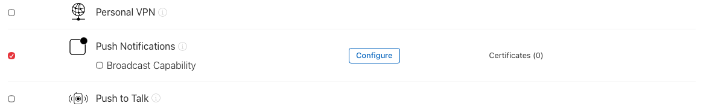
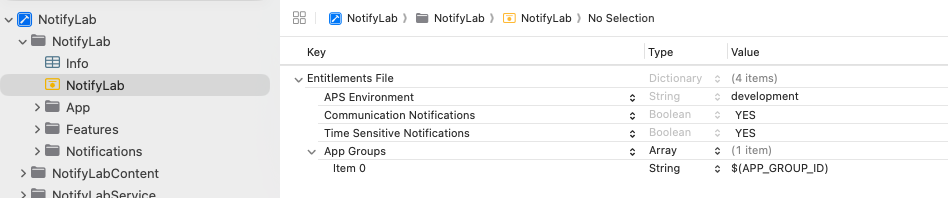
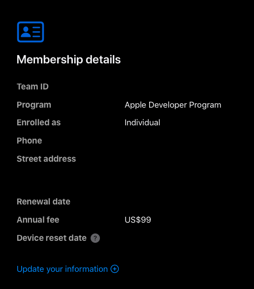

# iOS Notifications, End to End — Part 2: Wiring Up Push

*App ID, capabilities, entitlements and the `.p8` key: every switch you flip once, what each one really changes, and how to prove it worked before you write any push code.*

---

Local notifications needed nothing from Apple. Remote ones need four things to line up: an App ID with push turned on, a build signed with the right entitlement, a key your server signs its requests with, and the same environment on both sides. When one of them is off, nothing crashes. The push just never arrives, and APNs gives you a one-word reason, if you're lucky enough to be looking.

By the end of this part you'll have:

- Push turned on for your App ID, plus the capabilities NotifyLab needs for alerts, silent pushes, calls, time-sensitive and communication notifications
- A signed build you can **prove** carries `aps-environment`
- A `.p8` key, stored as a secret, and the JWT your server signs with it
- A one-command check that your key works, before you have a device
- Your first real push, answered with `200`

> You need a paid Apple Developer Program membership ($99 a year). The free Personal Team can't use push notifications.

> Code: `project.yml`, `tools/lib/apns.mjs` and `tools/check-key.mjs` in the NotifyLab repo.

---

## Two chains that meet at APNs


*Figure 1: the app side and the server side never touch, except at APNs.*

Setup is two separate chains.

**The app chain** runs through the first two columns. Your bundle ID gets an App ID on Apple's developer portal. Turning on push for that App ID changes the provisioning profile. The profile allows the `aps-environment` entitlement, and Xcode signs it into the build. That one value decides which APNs server your device tokens work with.

**The key chain** is the red line. You create a `.p8` key on the same portal, but it never goes into the app. It goes to your server, or to Firebase, which uses it to sign every request to APNs.

The two chains share only two things: your **bundle ID** (the server sends it as `apns-topic`) and the **environment** (sandbox or production). Most setup bugs are one of those two not matching.

---

## Step 1: The App ID

A **bundle ID** is the name in your Xcode project, like `com.yourco.notifylab`. An **App ID** is Apple's record of that name on developer.apple.com, with the list of capabilities your app is allowed to use. Push needs an **explicit** App ID. A wildcard like `com.yourco.*` can't have push.

With automatic signing you rarely create the App ID yourself. Xcode registers it the first time you build for a device, and ticks Push Notifications when you add the capability in Step 2. It's still worth opening once to see what Xcode did: **Certificates, Identifiers & Profiles → Identifiers → your app**.


*The App ID after Xcode's automatic signing. Leave Broadcast Capability off; it's for Live Activities.*

NotifyLab keeps every ID in one place in `project.yml`:

```yaml
    # The ONE place the IDs come from. Bundle IDs and the App Group are derived from it:
    #   app          $(BUNDLE_ID_PREFIX).notifylab
    #   extensions   $(BUNDLE_ID_PREFIX).notifylab.service / .content
    #   App Group    group.$(BUNDLE_ID_PREFIX).notifylab
    BUNDLE_ID_PREFIX: com.yourco
    APP_GROUP_ID: group.$(BUNDLE_ID_PREFIX).notifylab
```

To make them yours, run one command. It rewrites `project.yml`, the payload files and the tool configs, then regenerates the Xcode project:

```bash
./tools/set-bundle-prefix.sh com.yourname
```

Then set `DEVELOPMENT_TEAM` in `project.yml` to your Team ID (Step 4 shows where to find it) and run `xcodegen generate`. Picking your team in Xcode also works, until the next `xcodegen generate` resets it.

## Step 2: Capabilities, and what each switch changes

In Xcode, select the **NotifyLab** target → **Signing & Capabilities** → **+ Capability**. NotifyLab uses five for notifications, plus Local Network, which only lets the demo reach the token server on your Mac:


*The NotifyLab target. With "Automatically manage signing" on, Xcode updates the App ID and the profile for you.*

Each one writes something different, to a different place:

![Table of NotifyLab's notification capabilities. Push Notifications adds aps-environment to the entitlements, needed for any remote push. Background Modes, Remote notifications, adds remote-notification to UIBackgroundModes in Info.plist, for silent pushes. Background Modes, Voice over IP, adds voip to UIBackgroundModes, for PushKit calls. Time Sensitive Notifications adds an entitlement for the time-sensitive interruption level. Communication Notifications adds an entitlement plus NSUserActivityTypes in Info.plist, for messages that show the sender's photo. App Groups adds an entitlement to the app and both extensions, for sharing data.](tables/p2-capabilities.png)
*What each capability writes, and where.*

Two things in that table save hours:

1. **Background Modes are not entitlements.** They're a list in Info.plist (`UIBackgroundModes`). They don't touch your App ID or your profile. The other capabilities are entitlements: your provisioning profile has to allow them, which is why Xcode updates the App ID when you add one.
2. **The extensions need App Groups, and nothing else.** A Notification Service Extension never gets a device token, so it doesn't need Push Notifications. It does share data with the app, so it needs the same App Group.

When I added Communication Notifications for Part 5, I never opened the portal. The next ⌘R to my iPhone added the capability to the App ID and made a new profile, all through automatic signing. With manual signing you'd get an error like *"Provisioning profile … doesn't include the com.apple.developer.usernotifications.communication entitlement"* until you tick it on the App ID yourself.

NotifyLab generates its Xcode project with XcodeGen, so its capabilities are text in `project.yml` rather than clicks. For the app target:

```yaml
    info:
      path: NotifyLab/Info.plist
      properties:
        # …
        # Background Modes capability: silent pushes + VoIP pushes
        UIBackgroundModes:
          - remote-notification
          - voip
        # …
        # Communication notifications (Part 5): the intents the Service Extension donates.
        NSUserActivityTypes:
          - INSendMessageIntent
    entitlements:
      path: NotifyLab/NotifyLab.entitlements
      properties:
        aps-environment: development
        com.apple.developer.usernotifications.time-sensitive: true
        com.apple.developer.usernotifications.communication: true
        com.apple.security.application-groups:
          - $(APP_GROUP_ID)
```

And each extension gets only the App Group:

```yaml
    entitlements:
      path: NotifyLabService/NotifyLabService.entitlements
      properties:
        com.apple.security.application-groups:
          - $(APP_GROUP_ID)
```

If you click through Xcode instead, you end up with the same `.entitlements` file:



## Step 3: `aps-environment`, the value that picks the server

APNs runs two separate environments:

- **Sandbox**, `api.sandbox.push.apple.com`: for apps you run from Xcode
- **Production**, `api.push.apple.com`: for TestFlight and the App Store

A device token belongs to exactly one of them, and the build's `aps-environment` entitlement decides which. You don't switch it by hand. Xcode sets it from the provisioning profile: a development profile gives `development`, and TestFlight and App Store builds get `production` when you export them.

Send a development token to the production server and APNs answers **`400 BadDeviceToken`**. The token is fine; the server is wrong. It's the classic "worked yesterday" bug: the first TestFlight build goes out, and the server still talks to sandbox.

**Don't trust the file, check the build.** The entitlements file is only a request. What counts is what got signed:

```bash
codesign -d --entitlements - --xml NotifyLab.app | plutil -p -
```

On my iPhone build (Team ID and bundle ID prefix replaced):

```
{
  "application-identifier" => "ABCDE12345.com.yourco.notifylab"
  "aps-environment" => "development"
  "com.apple.developer.team-identifier" => "ABCDE12345"
  "com.apple.developer.usernotifications.communication" => true
  "com.apple.developer.usernotifications.time-sensitive" => true
  "com.apple.security.application-groups" => [
    0 => "group.com.yourco.notifylab"
  ]
  "get-task-allow" => true
}
```

Read two things. `aps-environment` is `development`, so this build's token works with sandbox only. And `$(APP_GROUP_ID)` has become a real group name. For a release, run the same command on the `.app` inside your exported `.ipa`. It must say `production`.

Run it on a **device** build. Simulator builds don't carry signed entitlements, so for them the command prints an empty `{}`.

## Step 4: The key (`.p8`)

Go to **Certificates, Identifiers & Profiles → Keys → +**:

1. Give it a name, like *NotifyLab APNs*.
2. Tick **Apple Push Notifications service (APNs)**, then click **Configure**.
3. Choose the **environment** (sandbox, production, or both) and the **key restriction** (team-scoped, or topic-specific with the bundle IDs it may push to). The next section helps you choose.
4. **Continue → Register → Download.**

You can download the `.p8` **once**. Put it somewhere safe right away. If you lose it, the only fix is a new key.

![The APNs key's details page: name NotifyLab APNs, Key ID and creator hidden, and the APNs service configured as Team scoped (All topics) [Sandbox & Production]](screenshots/p2-apns-key.png)
*The key's page after registering. Your server sends the Key ID (hidden here) in every JWT.*

Note two IDs next to the file. Both are 10 characters:

- **Key ID**: on the key's page.
- **Team ID**: under **Membership details** in your account.



### Key scoping (new in February 2025)

Until 2025, every APNs key could push to every app in your team, in both environments. A development key on a laptop could push to your real users. On February 17, 2025 Apple added two restrictions you set when you create a key:

- **Environment.** A key can be limited to sandbox or to production. Apple now recommends one key per environment. Keys that cover both still work.
- **Scope.** A **team-scoped** key covers every app in your team, and you can have at most 2 per environment. A **topic-specific** key covers only the bundle IDs you pick, up to 200 keys per environment. That suits large companies with many apps and teams.

Keys made before the change keep working for everything, so nothing forces you to rotate.

For this tutorial I made one team-scoped key for both environments, because it's the simplest to learn with. For a real app, make separate sandbox and production keys, so a key that lives on developer machines can't reach production.

### `.p8` or `.p12`?

Older tutorials export a push **certificate** (`.p12`) from Keychain. It still works, but in 2026 there's little reason to start there:


*Auth key vs certificate. The yearly expiry is the real cost.*

A certificate expires on a date nobody remembers, and push stops that morning. A key never expires. You rotate it when *you* choose.

### Where the key goes, and where it doesn't

- **Never in the app.** The app doesn't need it, and anything inside an app bundle can be extracted.
- **Never in git.** NotifyLab keeps it in `secrets/`, which is git-ignored, and points to it from `tools/.env`, which is git-ignored too.
- **On your server:** in a secret manager, not in a config file in the repo.
- **In Firebase:** Project settings → Cloud Messaging → Apple app configuration → upload. Firebase then signs the APNs requests for you (Part 3).

## Step 5: What your server does with the key (the JWT)

Your server never sends the key to APNs. It uses the key to sign a short token, a **JWT**, and sends that in the `authorization` header of every request. The JWT says which key signed it (`kid`, the Key ID), which team it belongs to (`iss`, the Team ID), and when it was made (`iat`).

NotifyLab's tools do it in a few lines of Node, with no dependencies (`tools/lib/apns.mjs`):

```js
// APNs rejects a JWT older than 60 min, and one refreshed more often than every 20 min.
// Cache it for 50 min.
let cached = { token: null, issuedAt: 0 };

/** Provider token: header {alg: ES256, kid: Key ID}, claims {iss: Team ID, iat: now}. */
export function makeJWT({ teamId, keyId, keyPath }) {
  const now = Math.floor(Date.now() / 1000);
  if (cached.token && now - cached.issuedAt < 50 * 60) return cached.token;

  const header = base64url(JSON.stringify({ alg: "ES256", kid: keyId }));
  const claims = base64url(JSON.stringify({ iss: teamId, iat: now }));
  const key = createPrivateKey(readFileSync(resolve(root, keyPath)));
  // JWT wants the raw r||s signature (IEEE P1363), not DER. This is the classic bug.
  const signature = sign("sha256", Buffer.from(`${header}.${claims}`), { key, dsaEncoding: "ieee-p1363" });

  cached = { token: `${header}.${claims}.${base64url(signature)}`, issuedAt: now };
  return cached.token;
}
```

Three rules come with it:

- **ES256 only.** The `.p8` is an elliptic-curve key, and APNs accepts no other algorithm.
- **Reuse each JWT for 20 to 60 minutes.** Older than an hour gets `403 ExpiredProviderToken`. A new one more often than every 20 minutes gets `429 TooManyProviderTokenUpdates`. Signing a fresh JWT for every request is how you hit the second one.
- **Mind the signature format.** Node's default ECDSA signature is DER-encoded, but a JWT needs the raw 64-byte `r||s`. Get it wrong and every request fails with `403 InvalidProviderToken`, even though your key is fine.

With Firebase you skip all of this. It signs with the `.p8` you uploaded.

---

## Test it

**1. Fill in `tools/.env`.**

```bash
cp tools/.env.example tools/.env
```

Set `TEAM_ID`, `KEY_ID`, `KEY_PATH` (for example `secrets/AuthKey_XYZ9876543.p8`) and `BUNDLE_ID`.

**2. Check the key. No device needed.**

```bash
node tools/check-key.mjs
```

It sends a push to a made-up device token (64 zeros). APNs checks your JWT before the token, so the answer tells you whether your key works:

```
sandbox     400 BadDeviceToken  ✓ key accepted
production  400 BadDeviceToken  ✓ key accepted
```

Here `BadDeviceToken` is the good answer: APNs accepted your key, then rejected the fake token. With a typo in the Key ID you'd see this instead:

```
sandbox     403 InvalidProviderToken  ✗ check KEY_ID, TEAM_ID and KEY_PATH
production  403 InvalidProviderToken  ✗ check KEY_ID, TEAM_ID and KEY_PATH
```

One limit: it can't check `BUNDLE_ID`, because APNs rejects the fake token before it looks at the topic.

**3. Check the signed build.** Run NotifyLab on your iPhone once (**⌘R**). In Xcode choose **Product → Show Build Folder in Finder**, open `Products/Debug-iphoneos`, and run the `codesign` command from Step 3 on `NotifyLab.app`. Look for `"aps-environment" => "development"`.

**4. Send your first push.** Part 3 is all about device tokens. For now, just copy yours: open NotifyLab on the iPhone → **Orders** → **APNs device token**, paste it into `DEVICE_TOKEN` in `tools/.env`, then:

```bash
./tools/apns.sh payloads/order-shipped.apns
```

```
→ api.sandbox.push.apple.com  type=alert  priority=10  topic=com.yourco.notifylab  bytes=314
HTTP/2 200
apns-id: <a UUID for this request>
apns-unique-id: <a UUID you can look up in the Delivery Log>
```

`200` means APNs accepted it, and the banner should appear on the phone. The first time I ran this for the article, APNs answered `400 MissingDeviceToken`, because I'd left `DEVICE_TOKEN` empty. APNs error names are that literal, so read them before you debug anything else:

![Table of the first APNs responses you'll meet. 200: accepted, not the same as shown. 403 InvalidProviderToken: wrong Key ID, Team ID, .p8 or a revoked key. 403 ExpiredProviderToken: the JWT is more than an hour old. 429 TooManyProviderTokenUpdates: a new JWT more often than every 20 minutes. 400 BadDeviceToken: the token belongs to the other environment. 400 TopicDisallowed: the key can't push to that bundle ID. 400 MissingDeviceToken: the token is empty. A TLS error: the server's trust store lacks the USERTrust RSA root from 2025.](tables/p2-first-errors.png)
*The first responses you'll meet, and what to do about each.*

---

## Production notes

- **Keep the `.p8` in a secret manager.** With the key, its Key ID and your Team ID, anyone can push to your users. For a team-scoped key, that's every app in your team.
- **One key per environment.** Since February 2025 you can restrict keys, so do it for anything real. Use topic-specific keys when many apps or teams share one account.
- **Rotate without downtime.** Create the new key, deploy it, then revoke the old one. Requests signed with a revoked key fail right away with `403 InvalidProviderToken`. Two team-scoped keys per environment is exactly enough for that overlap.
- **Store the environment next to every token.** Debug and TestFlight builds of the same app produce tokens for different servers. NotifyLab's app uploads `environment` with its token, and the registry server picks the APNs host from it.
- **Update your server's trust store.** APNs switched to server certificates from the *USERTrust RSA Certification Authority* on January 20, 2025 (sandbox) and February 24, 2025 (production). An old trust store fails with a TLS error before any HTTP response. Current OS and Node certificate bundles already include it; a CA file pinned in your repo may not.
- **HTTP/2 only.** APNs refuses HTTP/1.1. Use port 443, or 2197 if your network blocks 443.
- **Check every release build.** Run `codesign` on the app inside the exported `.ipa`. `aps-environment` must say `production`.

**Next: Part 3, Device tokens.** What the token really is, why it isn't a fixed length (80 bytes on the Simulator, 32 on my iPhone), why you get one before the user says yes, when it changes, and how Firebase swaps it for an FCM token.
