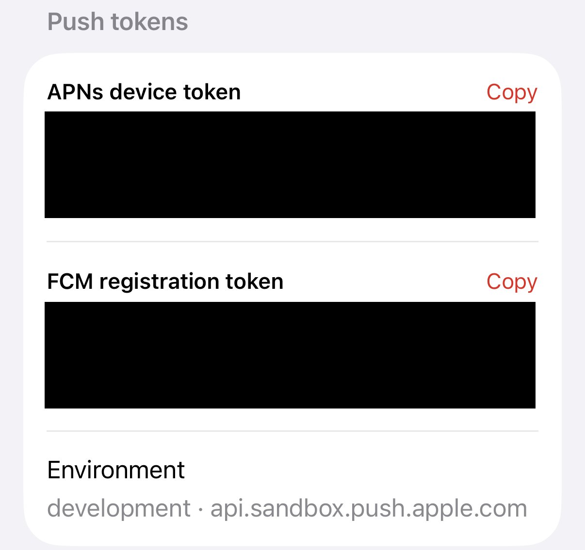
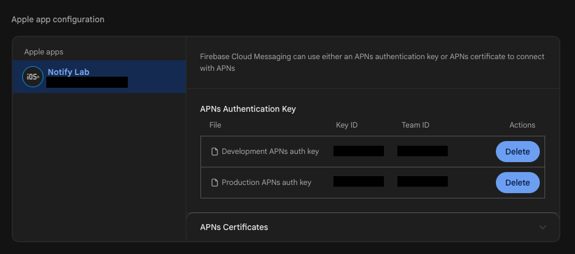

# iOS Notifications, End to End — Part 3: Device Tokens

*What the APNs token really is, why you get one before the user says yes, when it changes, how Firebase turns it into an FCM token, and the small server table that keeps your push list healthy.*

---

*This is Part 3 of [iOS Notifications, End to End](https://medium.com/@saadsherif02/ios-notifications-end-to-end-part-0-which-notification-do-you-need-cf3057ad7b9e). New to the series? Start with Part 0, the map.*

A device token is an address. Your server can't push without one, and it can go stale without anyone noticing. The phone never learns that its old token died. Your server finds out on the next send, and only if it's listening.

We're building the token half of NotifyLab's **Orders** tab. By the end you'll have:

- The APNs token on every launch, as a hex string, with no parsing
- FCM wired up with swizzling turned off, so you can see exactly where each token goes
- A device table on your server that the app updates only when something changed
- Dead tokens deleted on the send path, and silent devices pruned after 60 days
- Real sends, through FCM and straight to APNs

> Code: `PushTokenStore.swift`, `FirebaseBridge.swift` and `tools/registry-server.mjs` in the [NotifyLab repo](https://github.com/Sa3doola/NotifyLab). You need the key and `tools/.env` from Part 2.

---

## What a token is, and what it isn't


*The Orders tab on the Simulator. The APNs token here is 80 bytes, so it wraps to four lines. My iPhone's is 32 bytes.*

- **It's an address for one app, on one device, in one environment.** Change any of the three and you get a different token. A new bundle ID gets a new token. So does a TestFlight build of the same app on the same phone, because it uses production instead of sandbox.
- **It has no fixed length.** The Simulator gave me 80 bytes (160 hex characters), my iPhone gave me 32 (64 hex). Never parse a token, never check its length, and store it in a text column without a size limit.
- **It isn't permission.** You get a token before the user allows anything. Asking and registering are two separate calls.
- **It isn't forever.** iOS replaces it at moments your app isn't told about, which is why you ask for it on every launch.

![Fig 3: The token lifecycle. On the device: app launch or foreground, registerForRemoteNotifications, the APNs token and then the FCM token, then a check: changed since the last upload, or last upload older than 7 days? If yes, upload to the token registry on your server, which stores userId, deviceId, fcmToken, apnsToken, environment, appVersion and lastSeenAt. iOS issues a new token when the app is reinstalled, a backup is restored to a new device, the device is erased, or the build environment changes. Every send returns a verdict: 200 keep, 410 Unregistered delete, FCM 404 UNREGISTERED delete, 400 BadDeviceToken wrong environment, unseen for 60 days prune.](figures/fig3-token-lifecycle.png)
*Figure 3: the device never knows its token is dead. Your server finds out, on the send path.*

---

## Step 1: Ask for the token on every launch

The token request is one line in `application(_:didFinishLaunchingWithOptions:)`, and it runs on **every** launch:

```swift
        // 3. Ask for the APNs token on EVERY launch. This needs no permission,
        //    and it's how we notice a token that changed since last time.
        application.registerForRemoteNotifications()
```

iOS answers through one of two app delegate methods:

```swift
    func application(_ application: UIApplication,
                     didRegisterForRemoteNotificationsWithDeviceToken deviceToken: Data) {
        model.tokens.didReceiveAPNsToken(deviceToken)
        FirebaseBridge.shared.setAPNsToken(deviceToken)
    }

    func application(_ application: UIApplication,
                     didFailToRegisterForRemoteNotificationsWithError error: Error) {
        // Most common cause: the Push Notifications capability (aps-environment) is missing.
        model.tokens.didFailToRegister(error)
    }
```

The token arrives as raw bytes (`Data`). Turn it into hex, and do nothing else with it:

```swift
    func didReceiveAPNsToken(_ token: Data) {
        // The token is opaque bytes of no fixed length. Never parse it; just hex-encode it.
        let hex = token.map { String(format: "%02x", $0) }.joined()
        if hex != apnsToken { EventLog.add("APNs token \(hex.prefix(8))… (\(environment.rawValue))", source: "app") }
        apnsToken = hex
        registrationError = nil
        Task { await uploadIfNeeded() }
    }
```

Two old habits to drop:

- **Don't use `deviceToken.description`.** It prints `"32 bytes"`, not the token. Old Objective-C code that parsed the description broke in iOS 13.
- **Don't wait for permission before registering.** On a fresh install NotifyLab has its token before the user has seen any prompt. The token doesn't let you *show* anything; permission decides that. In my tests, a push sent with `xcrun simctl push` before permission was refused with *"Source is not authorized"*. But with the app open, `willPresent` still received it, so the app can react even though iOS draws nothing.

### When the token changes

Apple lists three moments when APNs issues a new token: the user **restores a backup onto a device**, **installs your app on a new device**, or **reinstalls the operating system**. Add the ones you'll meet while developing: deleting and reinstalling the app, changing the bundle ID, and switching between a Debug build and a TestFlight or App Store build. iOS updates aren't a documented trigger, but don't count on the token surviving one either. (If you come from Android: iOS has no "clear app data" that resets it.)

None of these tell your app anything. Your app only finds out because it asks again on the next launch and compares.

## Step 2: Upload only when something changed

Asking on every launch doesn't mean uploading on every launch. NotifyLab uploads when any token changed, or when the last upload is more than a week old, so the server's `lastSeenAt` stays fresh:

```swift
    /// Upload when a token changed, or at least once a week so the server's `lastSeenAt` stays fresh.
    func uploadIfNeeded(force: Bool = false) async {
        guard apnsToken != nil || fcmToken != nil || voipToken != nil else { return }
        let fingerprint = [apnsToken, fcmToken, voipToken, environment.rawValue]
            .map { $0 ?? "-" }.joined(separator: "|")
        let defaults = UserDefaults.standard
        let lastUpload = defaults.object(forKey: "registry.date") as? Date ?? .distantPast
        let isStale = Date.now.timeIntervalSince(lastUpload) > 7 * 24 * 3600
        guard force || fingerprint != defaults.string(forKey: "registry.fingerprint") || isStale else {
            uploadStatus = "Server already has these tokens"
            return
        }
        // …
        do {
            try await DeviceRegistry.upload(makeRecord(), to: base)
            defaults.set(fingerprint, forKey: "registry.fingerprint")
            defaults.set(Date.now, forKey: "registry.date")
            // …
```

Apple's docs say *never cache device tokens*. The warning is about sending to a saved copy instead of asking iOS. NotifyLab always uses the token iOS just delivered, and keeps the last uploaded value only to compare against.

What gets uploaded is one record **per device**, not per user:

```swift
/// What we send to our backend. One row per device, upserted by `deviceID`.
struct DeviceRecord: Codable, Sendable {
    let deviceID: String
    let userID: String
    let platform: String
    let bundleID: String
    let environment: APSEnvironment
    let apnsToken: String?
    let fcmToken: String?
    let voipToken: String?
    let appVersion: String
    let osVersion: String
}
```

The server adds `lastSeenAt` every time the device checks in. Here's my iPhone's row in the demo server's database (values shortened):

```json
{
  "deviceID": "39C989C6…",
  "userID": "demo-user",
  "platform": "ios",
  "bundleID": "com.yourco.notifylab",
  "environment": "development",
  "apnsToken": "75efc2bd…",
  "fcmToken": "f2Jh4KjD…",
  "voipToken": "56f1c779…",
  "appVersion": "1.0",
  "osVersion": "27.0",
  "lastSeenAt": "2026-09-24T03:18:10.449Z"
}
```

`environment` matters as much as the token. It tells the server which APNs host to use (Part 2). `voipToken` is a third, separate token for calls, from PushKit; Part 6 covers it.

## Step 3: Add FCM

Firebase Cloud Messaging sits between your server and APNs. You send to FCM, and FCM calls APNs with the `.p8` key you uploaded. You get one API for iOS and Android, topics, and a console. The price is one more hop and one more token to keep fresh.

The FCM token isn't a replacement for the APNs token. It's built **from** it: the Firebase SDK takes your APNs token, registers it with FCM, and hands you an FCM token that points to it. In NotifyLab's log both arrive in the same second at launch.

**1. Register the app in Firebase.** In the Firebase console, add an iOS app with your bundle ID and download `GoogleService-Info.plist`.

**2. Upload your APNs key.** Project settings → Cloud Messaging → Apple app configuration. Firebase has two slots, development and production. A key that covers both environments (like the one from Part 2) goes in both:


*One `.p8` in both slots. Firebase needs the Key ID and Team ID too, the same two from Part 2.*

**3. Add the SDK.** Only the FirebaseMessaging product is needed. In NotifyLab it's in `project.yml`:

```yaml
# FCM (Part 3). Only the FirebaseMessaging product is linked.
packages:
  Firebase:
    url: https://github.com/firebase/firebase-ios-sdk
    from: 12.19.0
```

The plist stays in the git-ignored `secrets/` folder, so every reader brings their own. A small build step copies it into the app, but only if it's there:

```yaml
    # FCM (Part 3): GoogleService-Info.plist lives in the git-ignored secrets/ folder, and each
    # developer brings their own. It's copied in only if it's there, so a fresh clone still builds
    # (with FCM off). A normal file reference would fail with "Build input file cannot be found".
    postBuildScripts:
      - name: Copy GoogleService-Info.plist if present
        basedOnDependencyAnalysis: false
        script: |
          PLIST="$SRCROOT/secrets/GoogleService-Info.plist"
          if [ -f "$PLIST" ]; then
            cp "$PLIST" "$TARGET_BUILD_DIR/$UNLOCALIZED_RESOURCES_FOLDER_PATH/"
          fi
```

Why not add the file to the project like any other? Because anyone who clones your repo doesn't have your plist, and Xcode stops with *"Build input file cannot be found"*. With the script, a fresh clone builds and runs with FCM off, and once you drop your plist into `secrets/`, the next build picks it up.

**4. Decide on swizzling.** By default the Firebase SDK *swizzles* your app delegate: it quietly intercepts the APNs token callback and hands the token to FCM itself. It works, but you can't see it happen, and it can clash with other SDKs that do the same. NotifyLab turns it off in Info.plist:

```yaml
        # We hand the APNs token to Firebase ourselves (see FirebaseBridge.swift)
        FirebaseAppDelegateProxyEnabled: false
```

With swizzling off, passing the token is your job. It's the second line of the `didRegister…` callback in Step 1, and it lands here:

```swift
    func configure(tokens: PushTokenStore) {
        // FirebaseApp.configure() crashes without the plist, so check first.
        guard Bundle.main.path(forResource: "GoogleService-Info", ofType: "plist") != nil else {
            EventLog.add("Firebase added, but GoogleService-Info.plist is missing", source: "app")
            return
        }
        self.tokens = tokens
        FirebaseApp.configure()
        Messaging.messaging().delegate = self
    }

    /// Info.plist sets FirebaseAppDelegateProxyEnabled = NO (no swizzling),
    /// so we hand the APNs token to FCM ourselves. FCM maps it to an FCM token.
    func setAPNsToken(_ token: Data) {
        guard isAvailable else { return }
        Messaging.messaging().apnsToken = token
    }
```

Forget that line and FCM never gives you a token, because it has no APNs token to point it at. The FCM row in the Orders tab never fills in, and the Xcode console says *"Declining request for FCM Token since no APNS Token specified"*. If you ask for the token yourself, you get error 505, *"No APNS token specified before fetching FCM Token"*. Before FirebaseMessaging 10.4 the SDK handed out a token anyway, so older answers online describe a token that looks fine and delivers nothing.

**5. Listen for the FCM token.** Firebase calls this on every launch and whenever the token changes. Treat it exactly like the APNs callback: store it and upload if it changed.

```swift
extension FirebaseBridge: MessagingDelegate {
    /// Called on launch and whenever the FCM token changes (reinstall, restore, new APNs token…).
    nonisolated func messaging(_ messaging: Messaging, didReceiveRegistrationToken fcmToken: String?) {
        Task { @MainActor in
            self.tokens?.didReceiveFCMToken(fcmToken)
        }
    }
}
```

## Step 4: Clean up on the send path

A token dies silently. The only reliable signal is the answer to your next send, so cleanup belongs where you send. NotifyLab's demo server (`tools/registry-server.mjs`) does three things around every send:

```js
  const db = load();
  pruneStale(db);
  // …
  for (const device of Object.values(db)) {
    // …
    const action = verdict(result);
    // 410: dead token. Delete it, unless the device uploaded it again after APNs gave up on it.
    const uploadedSince = result.timestamp && Date.parse(device.lastSeenAt) > result.timestamp;
    if (action === "delete" && !uploadedSince) delete db[device.deviceID];
```

1. **Delete on `410`.** APNs answers `410` (*Unregistered* or *ExpiredToken*) for a token it will never deliver to again, with a `timestamp` saying when it gave up. If the device uploaded the same token *after* that moment, it's alive again, so keep it.
2. **Prune the silent ones.** A device that hasn't checked in for 60 days gets removed:

```js
// The app re-uploads at least weekly. Firebase suggests treating a month of silence as stale;
// we give a device two months to come back before we stop sending to it.
const STALE_DAYS = 60;

function pruneStale(db) {
  const cutoff = Date.now() - STALE_DAYS * 24 * 3600 * 1000;
  for (const [id, device] of Object.entries(db)) {
    if (Date.parse(device.lastSeenAt) < cutoff) delete db[id];
  }
}
```

3. **Don't delete on everything else.** `400 BadDeviceToken` usually means the wrong environment, not a dead token (Part 2). Deleting there throws away good tokens.

"Token expiry" confuses people because it means four different things:

![Table of four kinds of token expiry. APNs device token: no timer; APNs answers 410 Unregistered or ExpiredToken with a timestamp; delete it unless the device uploaded it again after that timestamp. FCM registration token: on Android it expires after 270 days without contact, on iOS there's no timer and it follows APNs; FCM answers 404 UNREGISTERED; delete it. Your provider JWT: expires after 1 hour; APNs answers 403 ExpiredProviderToken; sign a new one every 20 to 60 minutes. Your own record: your own rule, not seen for N days, using lastSeenAt; prune it, Firebase suggests a month and NotifyLab uses 60 days.](tables/p3-token-expiry.png)
*Four things people mean by "the token expired". Only one of them is a real timer on iOS.*

---

## Test it

**1. See both tokens.** Run NotifyLab on the Simulator and open **Orders**. The APNs token is 160 hex characters, the FCM token a longer string with a colon in it, and the environment says `development · api.sandbox.push.apple.com`. The **Status** tab's event log shows the order they arrived in:

```
[app] APNs token 80a7e14f… (development)
[app] FCM token d3nxo9Ak…
```

Run it on an iPhone and the APNs token is 64 characters.

**2. Get a token without permission.** Delete NotifyLab from the Simulator, run it again, and open **Orders** before you touch *Turn on reminders*. The token is already there.

**3. Upload it.** Start the demo server:

```bash
node tools/registry-server.mjs
```

In the app, go to **Orders → Your server**, enter `http://localhost:8080` (on an iPhone, use your Mac's IP), and tap **Upload tokens now**. The server prints one line per upload, and you can list what it stored:

```bash
curl localhost:8080/devices
```

**4. Send through FCM.** Copy the FCM token into `FCM_TOKEN` in `tools/.env`, set `FCM_SERVICE_ACCOUNT` to your Firebase service-account JSON (Project settings → Service accounts → Generate new private key), then:

```bash
node tools/fcm.mjs payloads/order-shipped.apns
```

```
200 {
  "name": "projects/<your-project-id>/messages/<id>"
}
```

When I ran this against the Simulator, the order banner arrived a second later, and the event log showed the Service Extension saving the order: FCM → APNs → device, the whole way.

**5. See what a bad token looks like.** Values from the shell win over `tools/.env`, so you can try one without editing the file:

```bash
FCM_TOKEN=not-a-real-token node tools/fcm.mjs payloads/order-shipped.apns
```

```
400 {
  "error": {
    "code": 400,
    "message": "The registration token is not a valid FCM registration token",
    "status": "INVALID_ARGUMENT",
    …
```

A token that was valid and then died gets `404 UNREGISTERED` instead, which is your signal to delete it. Be careful with `INVALID_ARGUMENT`: FCM also uses it for a broken payload, so check the payload before you delete the token.

---

## Production notes

- **One row per device, not per user.** A user has several devices, and a shared device can change users. Upsert by device ID and send to every device of the user.
- **On logout, detach the device on your server.** Clear its `userID` so the next person on that phone doesn't get the last person's pushes. Don't call `unregisterForRemoteNotifications()`; Apple reserves it for rare cases, like a new app version that drops push entirely.
- **Store the environment with every token**, and pick the APNs host from it (Part 2).
- **Store tokens as text of any length.** A `CHAR(64)` column will break on the first token that isn't 32 bytes.
- **Upload on change, plus a weekly check-in.** Prune after a fixed silence (a month to two), and delete on `410` and FCM's `404` on the send path.
- **Pick one path per device.** If you store both tokens, send through FCM *or* straight to APNs, never both, or the user gets every notification twice.
- **`identifierForVendor` resets too.** It changes when the user deletes all your apps, just like the token. A new device ID is a new row; the old one gets pruned.
- **Treat tokens as personal data.** Delete a user's device rows when they delete their account.

**Next: Part 4, Sending.** The full journey in 15 steps, an APNs request line by line, and three real payloads (an order update, a marketing message and a silent sync), each with the headers that make it behave, plus the same sends through FCM's `apns` block.
