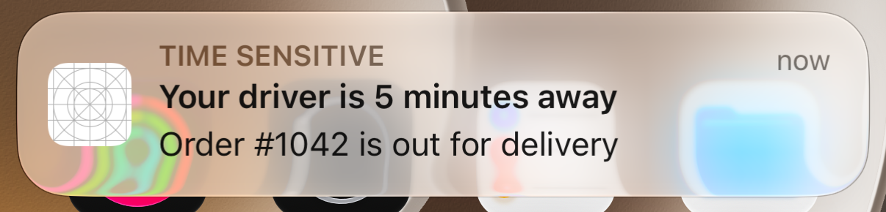
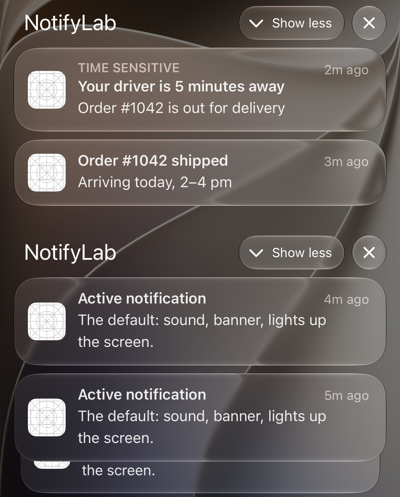
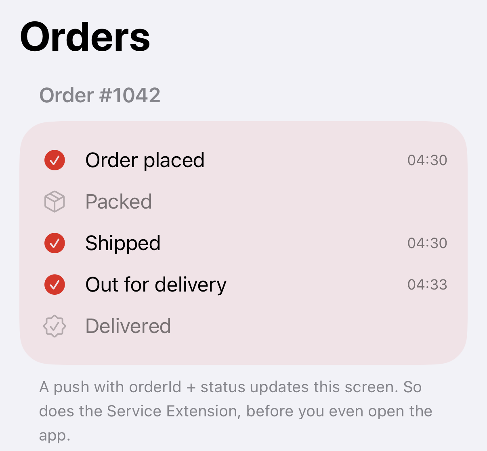

# iOS Notifications, End to End — Part 4: Sending

*The full journey in 15 steps, an APNs request line by line, and three real payloads (an order update, a marketing message and a silent sync), each with the headers that make it behave. Then the same sends through Firebase.*

---

You have a key (Part 2) and a token (Part 3). Sending is one HTTP request. What makes a push feel right is everything around that request: how urgent it says it is, whether it replaces the last one, how long APNs should keep trying, and what the app does when someone taps it.

We're finishing NotifyLab's **Orders** and **Sync** tabs. By the end you'll have:

- The whole journey from registration to tap, in 15 steps
- Every APNs header explained, and the right value for each kind of push
- An order update that replaces itself instead of piling up, and opens the right screen when tapped
- A marketing push that stays quiet, and the opt-out Apple requires
- A silent push that refreshes data in the background, and the rules that decide whether it arrives
- The same three sends through FCM HTTP v1



> Code: `payloads/`, `tools/apns.sh` and `tools/fcm.mjs` in the NotifyLab repo. You need the key and `tools/.env` from Part 2, and a token from Part 3.

---

## The journey, start to end


*Figure 2: two loops. Parts 1 to 3 built the first one; this part is the second.*

Here's every step, with the code or API behind it:

![Table of the 15 steps of a remote push. 1 Ask: requestAuthorization. 2 Register: registerForRemoteNotifications, works before permission. 3 iOS keeps an encrypted connection to APNs. 4 The APNs token arrives as Data and becomes hex. 5 It's handed to FCM. 6 FCM returns its own token. 7 and 8 Your API stores both by device ID. 9 and 10 Your server sends to FCM HTTP v1 with an OAuth token. 11 FCM signs a request to APNs with your .p8. Or your server calls APNs directly with a JWT. 12 APNs delivers, or keeps one notification per app while the device is offline. 13 The Service Extension runs when mutable-content is 1. 14 iOS checks permission, Focus, Scheduled Summary and the interruption level; in the foreground, willPresent decides. 15 A tap calls didReceive, which reads your keys and opens the right screen.](tables/p4-journey-steps.png)
*The whole journey. This part covers steps 9 to 12, and 15.*

---

## Anatomy of a request

Every send to APNs is one HTTP/2 `POST`. This is the request `tools/apns.sh` makes, and it's the same one your server makes in any language:

```bash
curl --http2 --silent --show-error --include \
  -H "authorization: bearer $JWT" \
  -H "apns-topic: $TOPIC" \
  -H "apns-push-type: $PUSH_TYPE" \
  -H "apns-priority: $PRIORITY" \
  ${EXTRA[@]+"${EXTRA[@]}"} \
  --data "$BODY" \
  "https://$HOST/3/device/$TOKEN"
```

(`EXTRA` adds the optional headers, `apns-collapse-id` and `apns-expiration`, when you set them.)

Four parts:

- **The URL**: `https://api.sandbox.push.apple.com/3/device/<token>` for Debug builds, `api.push.apple.com` for TestFlight and the App Store. HTTP/2 only, on port 443 (or 2197).
- **The JWT** from Part 2, in `authorization`.
- **The headers**, which tell APNs and iOS how to treat this push.
- **The body**: the JSON payload, at most **4 KB** (5 KB for VoIP).

The headers are where the behavior lives:

![Table of APNs headers and the value for each kind of push. apns-push-type: alert for an order update and for marketing, background for a silent sync. apns-priority: 10 sends now, 5 when it suits the battery, 1 never wakes the device; 10 for an order update, 5 for marketing, and 5 for a silent sync, where Apple's docs call 10 an error. apns-topic: your bundle ID, plus .voip for VoIP. apns-expiration: keep trying until this UNIX time, at most 30 days; 0 means try once; omitted means APNs decides. apns-collapse-id: a newer push with the same ID replaces the older one on screen, at most 64 bytes; order-1042 for the order update. apns-id: your UUID for the request, optional.](tables/p4-headers.png)
*The six headers, and what each kind of push should send.*

APNs answers with a status, an `apns-id`, and in the sandbox an `apns-unique-id` you can look up in Apple's Delivery Log (Part 7):

```
HTTP/2 200
apns-id: <a UUID for this request>
apns-unique-id: <a UUID you can look up in the Delivery Log>
```

`200` means APNs **accepted** the push. It doesn't mean the user saw it. Everything after step 12 of the journey happens on the device, and Part 7 is about that.

---

## Payload 1: An order update

This is `payloads/order-out-for-delivery.apns`:

```json
{
  "Simulator Target Bundle": "com.yourco.notifylab",
  "aps": {
    "alert": {
      "title": "Your driver is 5 minutes away",
      "body": "Order #1042 is out for delivery"
    },
    "sound": "default",
    "category": "ORDER",
    "thread-id": "order-1042",
    "mutable-content": 1,
    "interruption-level": "time-sensitive",
    "relevance-score": 1.0
  },
  "orderId": "1042",
  "status": "out_for_delivery",
  "eta": "5 min"
}
```

Everything Apple reads is inside `aps`:

- **`alert`**: the title and body the user sees.
- **`sound`**: `default`, or the name of a sound file in your app.
- **`category`**: picks the buttons, the same `ORDER` category the app registered in Part 1 (*Track order*, *Call driver*).
- **`thread-id`**: groups this notification with the others for the same order in Notification Center.
- **`mutable-content: 1`**: lets the Service Extension change it before it's shown (Part 5).
- **`interruption-level`** and **`relevance-score`**: how loud it is (Part 1), and where it sorts in the Scheduled Summary.

Everything **outside** `aps` is yours: `orderId`, `status`, `eta`. iOS passes them to the app untouched, and they're what the app uses to open the right screen. Send IDs, not content. The app can always fetch the details.

`Simulator Target Bundle` is only for the Simulator: it tells it which app the file is for when you drag the file onto it or use `xcrun simctl push`. NotifyLab's tools remove it before sending, so it doesn't count toward the 4 KB.

### Replace, don't pile up

An order goes through five states. Without a collapse ID, the user ends up with five notifications for one parcel. With one, each update **replaces** the last:

```bash
COLLAPSE_ID=order-1042 ./tools/apns.sh payloads/order-out-for-delivery.apns
```

I tested it on the Simulator: I sent *"Your driver is 5 minutes away"* with `apns-collapse-id: order-1042`, then *"Order #1042 shipped"* with the same ID three minutes later. Only the second one was left in Notification Center. The older notifications, sent without a collapse ID, all stayed.

`thread-id` and `apns-collapse-id` sound alike and do different jobs:

- **`thread-id`** (in the payload) **groups** notifications. They all stay, stacked together.
- **`apns-collapse-id`** (a header) **replaces** one. Only the newest stays.


*Two threads from one app: `order-1042` on top, the habit samples below. Same app, grouped by `thread-id`.*

Set an **expiration** too. "Your driver is 5 minutes away" is useless an hour later. If the phone is off, you don't want APNs to deliver it tomorrow morning:

```bash
EXPIRATION=$(( $(date +%s) + 3600 )) COLLAPSE_ID=order-1042 ./tools/apns.sh payloads/order-out-for-delivery.apns
```

### The tap

When the user taps, iOS calls the notification delegate from Part 1, and NotifyLab's router opens the order. `NotificationEvent` has already copied `orderId` and `status` out of `userInfo` into an `OrderUpdate`:

```swift
        default:
            // Plain tap, or "Track order": deep-link to the right screen.
            if let order = event.order {
                orders.apply(order)
                navigation.highlightedOrderID = order.orderID
                navigation.tab = .orders
            } else if event.categoryID == CategoryID.habit {
                navigation.tab = .habits
            } else if event.categoryID == CategoryID.message {
                navigation.tab = .orders
            }
            EventLog.add("Opened from notification: \(event.title)", source: "app")
```


*After a tap: the Orders tab, with order #1042 highlighted and its timeline updated from the push.*

If the app is already open, `willPresent` runs instead of a tap. NotifyLab shows the banner **and** updates the screen in place, so the timeline moves while you watch:

```swift
    /// App is open and a notification arrives. Without this, iOS shows nothing.
    func presentInForeground(_ event: NotificationEvent) -> UNNotificationPresentationOptions {
        EventLog.add("Arrived in foreground: \(event.title)", source: "app")
        if let order = event.order {
            orders.apply(order)          // update the screen in place, too
        }
        return [.banner, .list, .sound, .badge]
    }
```

---

## Payload 2: A marketing message

`payloads/marketing-passive.apns`:

```json
{
  "Simulator Target Bundle": "com.yourco.notifylab",
  "aps": {
    "alert": {
      "title": "New this week",
      "body": "Five habits people stick with. Tap to read."
    },
    "mutable-content": 1,
    "interruption-level": "passive",
    "relevance-score": 0.2
  },
  "image": "https://picsum.photos/seed/notifylab-promo/600/400.jpg"
}
```

What makes it polite:

- **No `sound`**, and **`passive`**: it goes quietly into Notification Center without lighting up the screen.
- **`relevance-score: 0.2`**: it sorts low in the Scheduled Summary.
- **Priority 5** in the header: APNs delivers it when it suits the battery, not this second.

```bash
./tools/apns.sh payloads/marketing-passive.apns marketing
```

Apple's App Review Guidelines (4.5.4) add a rule of their own: don't send promotions or marketing by push unless the user **explicitly opted in** through wording in your app, and give them a way **in the app** to opt out. The system permission prompt isn't that consent. Keep a separate "Offers and news" switch, store it on your server, and check it before every marketing send.

---

## Payload 3: A silent sync

`payloads/silent-sync.apns` is the smallest payload in the repo:

```json
{
  "Simulator Target Bundle": "com.yourco.notifylab",
  "aps": {
    "content-available": 1
  },
  "reason": "new-orders"
}
```

`content-available: 1` and nothing else in `aps`: no alert, no sound, no badge. iOS wakes your app in the background, shows nothing, and gives it about **30 seconds**. No permission is needed, because nothing is shown. The headers must match: `apns-push-type: background` and `apns-priority: 5`. Apple's docs call priority 10 for a background push an error. When I tried it, the sandbox still answered `200`, so nothing will warn you. Follow the docs anyway.

```bash
./tools/apns.sh payloads/silent-sync.apns background
```

The app side is one app delegate method, plus the **Remote notifications** background mode from Part 2:

```swift
    /// Runs in the background for ~30 s. Not called if the user force-quit the app.
    func application(_ application: UIApplication,
                     didReceiveRemoteNotification userInfo: [AnyHashable: Any]) async -> UIBackgroundFetchResult {
        await model.sync.handleSilentPush(userInfo)
    }
```

```swift
    func handleSilentPush(_ userInfo: [AnyHashable: Any]) async -> UIBackgroundFetchResult {
        let reason = userInfo[PayloadKey.reason] as? String ?? "unspecified"
        EventLog.add("Silent push woke the app (reason: \(reason))", source: "app")

        // Real apps fetch changes from their API here. Finish well within ~30 s,
        // or iOS gives your app fewer background wake-ups in the future.
        try? await Task.sleep(for: .seconds(1))

        let defaults = AppGroup.defaults
        defaults.set(defaults.integer(forKey: "sync.count") + 1, forKey: "sync.count")
        defaults.set(Date.now, forKey: "sync.date")
        defaults.set(reason, forKey: "sync.reason")
        reload()
        return .newData
    }
```

A silent push is a **hint**, not a message. iOS decides whether to deliver it:

- **It isn't guaranteed.** Apple says so in as many words, and asks you not to send more than **two or three per hour**.
- **Force-quit kills it.** If the user swiped the app away, iOS drops silent pushes until they open it again.
- **Low Power Mode and Background App Refresh** delay it or stop it. The Sync tab shows both.
- **The Simulator won't wake for it.** `xcrun simctl push` refuses the file (*"no user visible content"*), and a real sandbox push to the Simulator gets `200` from APNs but never wakes the app. On my iPhone the same push woke the app and the Sync counter went up.

So never rely on it alone. Sync again every time the app opens, and treat the silent push as a way to be early.

---

## The same sends through FCM

With Firebase, you send to FCM and FCM calls APNs for you (steps 9–11). NotifyLab's `tools/fcm.mjs` reuses the exact same payload files. The whole APNs payload goes into `apns.payload`, and the APNs headers into `apns.headers`:

```js
// The whole APNs payload goes in apns.payload. FCM passes it through to APNs unchanged,
// so custom keys (orderId, status, image) arrive at the top level on the device.
const apnsHeaders = headersFor(type, "ignored");
delete apnsHeaders["apns-topic"]; // FCM sets the topic from the iOS app you registered
const message = {
  message: {
    token: process.env.FCM_TOKEN,
    apns: { headers: apnsHeaders, payload: readPayload(file) },
  },
};
```

```bash
node tools/fcm.mjs payloads/order-out-for-delivery.apns
node tools/fcm.mjs payloads/marketing-passive.apns marketing
node tools/fcm.mjs payloads/silent-sync.apns background
```

Three things to know:

- **Only HTTP v1 exists now.** The old "legacy" FCM API with a server key was shut down in 2024. If a tutorial shows `Authorization: key=…`, it's out of date.
- **You don't set `apns-topic`.** FCM fills it in from the iOS app registered in your Firebase project.
- **The `apns` block is iOS-only.** If the same message also goes to Android, add an `android` block, or use the shared `notification` block for a plain title and body. NotifyLab sends only to iOS, so it uses the `apns` block for full control.

---

## 4 KB, and what to do about it

Apple documents the limit as **4 KB (4,096 bytes)** for a normal push and 5 KB for VoIP. NotifyLab's Node sender checks it before sending:

```js
  const limit = type === "voip" ? 5120 : 4096;
  if (Buffer.byteLength(body) > limit) {
    return Promise.reject(new Error(`Payload is ${Buffer.byteLength(body)} bytes; the limit is ${limit}.`));
  }
```

It counts **bytes**, not characters. The en dash in "2–4 pm" is one character but three bytes, so `order-shipped.apns` is 310 characters and 314 bytes.

I tested where APNs actually draws the line. The sandbox accepted payloads up to **5,120 bytes**, and returned `413 PayloadTooLarge` at 5,121. Don't build on that: it's undocumented, I only checked the sandbox, and Apple can tighten it any day. Stay under 4 KB.

In practice you never get close if you **send IDs, not content**. Put `orderId` in the push and let the app (or the Service Extension) fetch the details.

---

## Test it

**1. An order update.** With your token in `DEVICE_TOKEN`, lock the Simulator or phone and send:

```bash
COLLAPSE_ID=order-1042 ./tools/apns.sh payloads/order-shipped.apns
```

The *"Order #1042 shipped"* banner arrives. Leave it there; tapping it would remove it from Notification Center.

**2. Replace it.** Send the next update with the same collapse ID:

```bash
COLLAPSE_ID=order-1042 ./tools/apns.sh payloads/order-out-for-delivery.apns
```

You get a *Time Sensitive* banner. Pull down Notification Center: only the newest one is left.

**3. Tap it.** NotifyLab opens on **Orders** with the order highlighted.

**4. A quiet one.** Send the marketing push:

```bash
./tools/apns.sh payloads/marketing-passive.apns marketing
```

No banner and no sound. It's waiting in Notification Center.

**5. A silent sync (iPhone only).** Open NotifyLab once, go to the home screen (don't swipe the app away), and send:

```bash
./tools/apns.sh payloads/silent-sync.apns background
```

Open the **Sync** tab: *Background wake-ups* went up by one, with the reason `new-orders`.

**6. Through FCM.** With `FCM_TOKEN` set (Part 3), repeat any of the above with `node tools/fcm.mjs` instead of `./tools/apns.sh`.

Every command also works for many devices at once through the demo server. `collapseId` is optional:

```bash
curl -X POST localhost:8080/send -H 'content-type: application/json' \
  -d '{"file":"payloads/order-out-for-delivery.apns","collapseId":"order-1042"}'
```

---

## Production notes

- **`200` is not delivered.** It means APNs accepted the request. Log the `apns-id` of every send so you can trace it later (Part 7).
- **Match priority to the user's need.** `10` for what they need now, `5` for everything else. Never `10` for a background push.
- **Collapse state, expire news.** Use `apns-collapse-id` for anything that has a *current* state (an order, a score), and `apns-expiration` for anything that goes stale (an ETA, a flash sale).
- **Marketing needs its own opt-in and an in-app opt-out** (App Review Guideline 4.5.4). Check it on the server before every marketing send.
- **Silent pushes are hints.** Two or three an hour at most, never after a force-quit, never guaranteed. Always sync on launch too.
- **Keep connections open.** Apple asks providers to reuse HTTP/2 connections across many pushes, and treats rapid connect/disconnect as a denial-of-service pattern. NotifyLab's tools open one connection per send, which is fine for a demo and wrong for a real server.
- **Retry only what can succeed later.** Retry `429`, `500` and `503` with backoff. Never retry a `400`, `403` or `410` unchanged; fix the request or the token instead (Part 2's error table, Part 3's cleanup).
- **Send IDs, not content.** It keeps you far below 4 KB, and the same guideline (4.5.4) says pushes shouldn't carry sensitive personal or confidential information anyway.

**Next: Part 5, Rich and communication notifications.** The Service Extension that downloads the product photo and saves the order before the user opens the app, the Content Extension that draws the live order card, and the driver's message that shows the driver's photo instead of your app icon.
