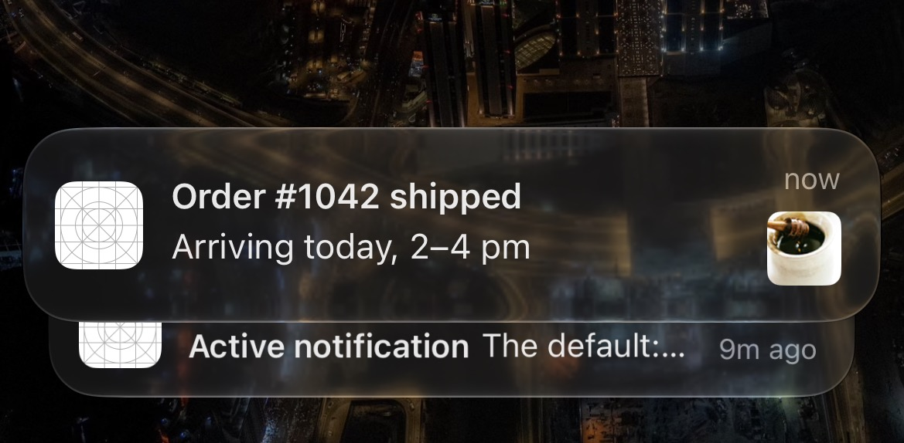
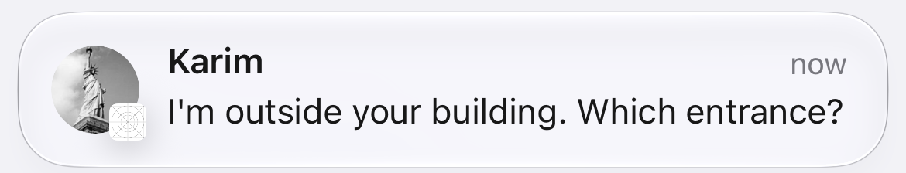
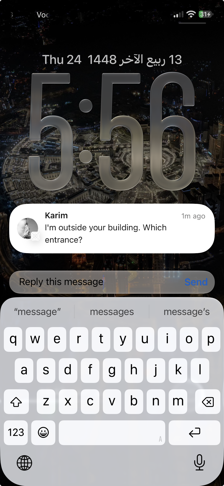
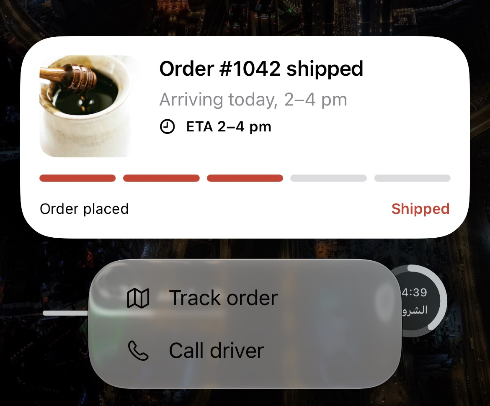

# iOS Notifications, End to End — Part 5: Rich and Communication Notifications

*A Service Extension that adds a product photo and saves the order before the user opens the app, a message from your driver that shows their photo instead of your app icon, and a Content Extension that draws a live order card on long-press.*

---

*This is Part 5 of [iOS Notifications, End to End](https://medium.com/@saadsherif02/ios-notifications-end-to-end-part-0-which-notification-do-you-need-cf3057ad7b9e). New to the series? Start with Part 0, the map.*

Everything so far has been text. This part adds what makes a notification feel like part of your app: a photo of the parcel, a message that looks like it came from a person, and a card with real UI behind a long-press. None of it needs a new kind of push. It's the same alert from Part 4, plus two small extensions that iOS runs for you.

By the end you'll have:

- A **Service Extension** that downloads the product photo and saves the order update, before the banner appears
- A fallback that still shows the text when the 30 seconds run out
- A **communication notification**: the driver's message with their photo and name, and a Reply button
- A **Content Extension** with a SwiftUI order card and a *Call driver* button that works without opening the app
- A way to debug both, and a list of reasons an extension silently doesn't run


*The same "shipped" push as Part 4, now with a photo the Service Extension downloaded.*

> Code: the `NotifyLabService` and `NotifyLabContent` folders in the [NotifyLab repo](https://github.com/Sa3doola/NotifyLab). Test on an iPhone: the Simulator runs the Service Extension but can't draw the thumbnail.

---

## Two extensions, two moments

![Fig 4: The rich notification pipeline. Before it's shown: a push payload with mutable-content 1, category ORDER and an image URL goes through APNs, which wakes the Service Extension. It runs before the notification is shown, adds the image or a sender photo, and has about 30 seconds before iOS falls back to the original text. The banner shows the title, body and thumbnail. After the user engages: a long-press opens the Content Extension, chosen by category, with SwiftUI in a hosting view. Its actions are handled either in the extension with doNotDismiss, or by the app with dismissAndForwardAction.](figures/fig4-rich-pipeline.png)
*Figure 4: the Service Extension works before the notification is shown; the Content Extension works after the user long-presses it.*

Both are separate targets with their own bundle IDs (`…notifylab.service` and `…notifylab.content`), and each runs in its own small process. They can't call into your app. They share data with it through the App Group from Part 2.

- The **Service Extension** runs *before* iOS shows a notification. It gets about **30 seconds** to change it: add a photo, rewrite the text, decrypt it, save data. It runs only for **remote** pushes with `mutable-content: 1` and a visible title or body, and only if alerts are on for your app. Never for local notifications, never for silent ones.
- The **Content Extension** runs *after*, when the user long-presses a notification. It draws your own UI, picked by the notification's category. It works for local notifications too.

---

## The Service Extension

### Step 1: Quick work first

iOS hands you the notification and a *content handler*: the function you call, exactly once, with the version to show. NotifyLab does the cheap, important work first, so there's something good to show even if the slow part fails:

```swift
        guard let content = request.content.mutableCopy() as? UNMutableNotificationContent else {
            contentHandler(request.content)
            return
        }

        // 1. Quick work first. If time runs out later, iOS shows at least this.
        let update = OrderUpdate(userInfo: content.userInfo)
        if let update {
            SharedOrders.apply(update)   // the app is up to date before the user opens it
            if content.title.isEmpty {
                content.title = "Order #\(update.orderID): \(update.status.title)"
            }
            EventLog.add("Service extension saved order \(update.orderID) → \(update.status.title)", source: "service")
        }
        let imageURL = update?.imageURL
            ?? (content.userInfo[PayloadKey.imageURL] as? String).flatMap(URL.init(string:))

        lock.withLock {
            self.contentHandler = contentHandler
            self.bestAttempt = content
        }
```

`SharedOrders.apply(update)` writes the new order status into the App Group. When the user taps the banner, the Orders screen is already up to date, with no network request.

### Step 2: Slow work, download and attach

Then the photo. `order-shipped.apns` carries its URL as a custom key, `"image"`. The comment in the code says step 3 because step 2, the chat-message branch, has its own section below.

```swift
        // 3. Slow work: download the image and attach it.
        guard let imageURL else {
            finish()
            return
        }
        Task {
            let attachment = await Self.downloadAttachment(from: imageURL)
            if attachment != nil {
                EventLog.add("Service extension attached image", source: "service")
            }
            self.finish { content in
                if let attachment { content.attachments = [attachment] }
                return content
            }
        }
```

```swift
    /// Downloads to a temp file with the right extension. iOS uses the file extension to
    /// work out the type. Limits: image 10 MB, audio 5 MB, video 50 MB.
    private static func downloadAttachment(from url: URL) async -> UNNotificationAttachment? {
        do {
            let (downloaded, response) = try await URLSession.shared.download(from: url)
            let ext = url.pathExtension.isEmpty
                ? ((response.mimeType?.contains("png") ?? false) ? "png" : "jpg")
                : url.pathExtension
            let file = FileManager.default.temporaryDirectory
                .appending(path: "\(UUID().uuidString).\(ext)")
            try FileManager.default.moveItem(at: downloaded, to: file)
            return try UNNotificationAttachment(identifier: "image", url: file)
        } catch {
            return nil
        }
    }
```

Three rules hide in there:

- **The file must be on disk** before you create the attachment. A URL to the internet isn't enough.
- **The file extension matters.** iOS works out the type from it (unless you pass a type hint), so save downloads as `.jpg` or `.png`, never as a bare temp file.
- **Stay under the limits**: images (JPEG, GIF, PNG) 10 MB, audio 5 MB, video 50 MB. iOS checks the file and moves it into its own store, so don't try to use it afterwards.

### Step 3: When time runs out

If the download is still going after about 30 seconds, iOS calls `serviceExtensionTimeWillExpire()`. You must deliver *something* right away. NotifyLab delivers the "best attempt" from Step 1, the text without the photo:

```swift
    /// iOS is about to kill the extension. Deliver whatever we have.
    override func serviceExtensionTimeWillExpire() {
        EventLog.add("Service extension ran out of time; showing original text", source: "service")
        finish()
    }

    private func finish(_ transform: (UNMutableNotificationContent) -> UNNotificationContent = { $0 }) {
        lock.lock()
        let handler = contentHandler
        let content = bestAttempt
        contentHandler = nil
        lock.unlock()

        guard let handler, let content else { return }   // already delivered
        handler(transform(content))
    }
```

The download and the timeout race each other, and the handler must be called **exactly once**. The lock makes sure whichever path gets there first wins, and the other one finds `contentHandler` already `nil` and does nothing. That shared state is also why the class is marked `@unchecked Sendable` in Swift 6: the lock is what makes it safe, and the compiler can't see that on its own.

If you never call the handler, iOS gives up and shows the original notification anyway. You don't lose the push, but you lose everything you added.

---

## Communication notifications: a message with a face


*The driver's message. The sender's photo and name replace the app icon; NotifyLab shrinks to a badge.*

The same Service Extension can turn an alert into a **message from a person**. iOS then shows the sender's photo and name instead of your app icon, treats it like a message from Messages or WhatsApp, and lets it through the Scheduled Summary by default. In NotifyLab it's the delivery driver writing to you.

It takes three things:

1. **The Communication Notifications capability** on the app target (Part 2). Automatic signing adds it to your App ID on the next build to a device.
2. **`INSendMessageIntent` in the app's `NSUserActivityTypes`**, shown below.
3. **Code in the Service Extension** that describes the message to the system.

The second one is three lines in `project.yml`:

```yaml
        # Communication notifications (Part 5): the intents the Service Extension donates.
        NSUserActivityTypes:
          - INSendMessageIntent
```

The push itself is an ordinary alert with `mutable-content: 1`, plus who sent it and which chat it belongs to (`payloads/driver-message.apns`):

```json
{
  "Simulator Target Bundle": "com.yourco.notifylab",
  "aps": {
    "alert": {
      "title": "Karim, your driver",
      "body": "I'm outside your building. Which entrance?"
    },
    "sound": "default",
    "category": "MESSAGE",
    "thread-id": "chat-order-1042",
    "mutable-content": 1
  },
  "sender": {
    "id": "driver-17",
    "name": "Karim",
    "avatar": "https://picsum.photos/seed/notifylab-driver/200/200.jpg"
  },
  "conversationId": "chat-order-1042"
}
```

The alert's title is a fallback. If the extension fails, the user still sees "Karim, your driver" as a normal notification.

In the extension, a message takes its own branch:

```swift
        // 2. A message from a person: show it as a communication notification.
        if let message = ChatMessage(userInfo: content.userInfo, text: content.body) {
            Task {
                let intent = await Self.donateMessageIntent(for: message)
                self.finish { content in
                    do {
                        // Swaps the app icon for the sender's photo and name.
                        return try content.updating(from: intent)
                    } catch {
                        EventLog.add("updating(from:) failed: \(error.localizedDescription)", source: "service")
                        return content
                    }
                }
            }
            return
        }
```

The real work is describing the message in the system's own words, then *donating* it:

```swift
    private static func donateMessageIntent(for message: ChatMessage) async -> INSendMessageIntent {
        // Pass the photo as bytes. We download it here, inside the extension's 30 seconds.
        var avatar: INImage?
        if let url = message.avatarURL, let data = try? await URLSession.shared.data(from: url).0 {
            avatar = INImage(imageData: data)
        }
        let sender = INPerson(
            personHandle: INPersonHandle(value: message.senderID, type: .unknown),
            nameComponents: nil,
            displayName: message.senderName,
            image: avatar,
            contactIdentifier: nil,
            customIdentifier: message.senderID
        )
        let intent = INSendMessageIntent(
            recipients: nil,                          // one-to-one: the user is the recipient
            outgoingMessageType: .outgoingMessageText,
            content: message.text,
            speakableGroupName: nil,
            conversationIdentifier: message.conversationID,   // same ID for the whole chat
            serviceName: nil,
            sender: sender,
            attachments: nil
        )

        let interaction = INInteraction(intent: intent, response: nil)
        interaction.direction = .incoming
        do {
            try await interaction.donate()
            EventLog.add("Service extension: message from \(message.senderName) → communication notification", source: "service")
        } catch {
            EventLog.add("Intent donation failed: \(error.localizedDescription)", source: "service")
        }
        return intent
    }
```

Piece by piece:

- **`INPerson`** is the sender: a stable ID from your backend (`driver-17`), the display name, and the photo.
- **`INSendMessageIntent`** is the message. For a one-to-one chat, `recipients` is `nil`: the user is the recipient, and Apple asks you never to list the current user as a participant. `conversationIdentifier` must be the same for every message in the chat.
- **Donating** the interaction, marked `.incoming`, tells the system this conversation happened. Then **`content.updating(from: intent)`** returns a new version of the notification with the person's photo and name.
- **Group chats** work the same way, with the *other* participants in `recipients`, a group name in `speakableGroupName`, and a group photo set with `intent.setImage(groupPhoto, forParameterNamed: \.speakableGroupName)`.

About Focus: a communication notification skips the Scheduled Summary by default, but it doesn't automatically break through a Focus. It gets through when the sender is on that Focus's list of allowed people, or your app is on its list of allowed apps. The user decides, not you.

### Reply without opening the app

The payload's `category` is `MESSAGE`, which gives the notification a text field:

```swift
        // Chat message from the driver: reply without opening the app.
        // The sender's photo comes from the Service Extension (communication notification).
        let reply = UNTextInputNotificationAction(
            identifier: ActionID.messageReply,
            title: "Reply",
            options: [],
            icon: UNNotificationActionIcon(systemImageName: "arrowshape.turn.up.left"),
            textInputButtonTitle: "Send",
            textInputPlaceholder: "Message"
        )
```


*Long-press, type, Send. The app gets the text in the background and never opens.*

The typed text arrives in the same notification router as every other button (Part 1):

```swift
        case ActionID.messageReply:
            EventLog.add("Reply to driver: \(event.typedText ?? "")", source: "app")
```

I tested the whole path on my iPhone: the photo and name replaced the app icon, the Reply text reached the app, and Xcode's automatic signing added the capability to the App ID and profile by itself on the first ⌘R.

---

## The Content Extension: a card behind the long-press


*Long-press an order notification and the Content Extension draws this card. The buttons come from the ORDER category.*

A Content Extension is a view controller that iOS shows when the user long-presses a notification. Which notifications get it is decided in its Info.plist:

```yaml
          NSExtensionAttributes:
            UNNotificationExtensionCategory: ORDER          # must match aps.category
            UNNotificationExtensionInitialContentSizeRatio: 0.62
            UNNotificationExtensionDefaultContentHidden: true   # our card shows title/body itself
            UNNotificationExtensionUserInteractionEnabled: false
```

- **`UNNotificationExtensionCategory`**: only notifications with `"category": "ORDER"` get this card. The driver's message (`MESSAGE`) doesn't.
- **`…InitialContentSizeRatio`**: height as a fraction of width, used before your view has laid itself out. Get it close to avoid a visible jump.
- **`…DefaultContentHidden`**: hides iOS's own title and body under the card, because the card shows them itself.
- **`…UserInteractionEnabled`**: `false` means taps on the card open the app, and only the action buttons do anything else. Set it to `true` only if the card has its own controls.

The view controller hosts a SwiftUI view and fills it from the notification:

```swift
    /// Called with each notification in the group. Update the UI for the newest one.
    func didReceive(_ notification: UNNotification) {
        let content = notification.request.content
        card.title = content.title
        card.body = content.body
        card.update = OrderUpdate(userInfo: content.userInfo)
        if let id = card.update?.orderID {
            card.timeline = SharedOrders.timelines()[id] ?? []
        }
        card.image = Self.loadImage(from: content.attachments.first)
        card.note = nil
        EventLog.add("Content extension showed the order card", source: "content")
    }
```

The photo the Service Extension attached is available here too, and the timeline comes from the same App Group the Service Extension just wrote to. The two extensions never talk to each other, but they share the same data.

### Buttons: handle them here, or hand them to the app

When the user taps a button under the card, the Content Extension hears about it first and decides:

```swift
    /// Action buttons come here first. We decide: handle in place, or open the app.
    func didReceive(_ response: UNNotificationResponse,
                    completionHandler completion: @escaping (UNNotificationContentExtensionResponseOption) -> Void) {
        switch response.actionIdentifier {
        case ActionID.orderContact:
            card.note = "Calling your driver…"
            EventLog.add("Call driver tapped in the content extension", source: "content")
            completion(.doNotDismiss)              // stay open, card updated
        default:
            completion(.dismissAndForwardAction)   // e.g. "Track order": let the app handle it
        }
    }
```

- **`.doNotDismiss`**: the card stays open and updates. *Call driver* shows "Calling your driver…" right there.
- **`.dismissAndForwardAction`**: the card closes and the action goes to the app's notification router, as if there were no extension. *Track order* opens the Orders tab.

One Swift 6 detail: the class declares `@preconcurrency UNNotificationContentExtension`. The protocol isn't marked as main-actor, but a view controller is, and iOS calls these methods on the main thread. `@preconcurrency` lets the conformance compile, and Swift checks the main thread at runtime.

---

## Debugging extensions

Extensions fail quietly. The notification just shows up plain, and nothing tells you why. Four habits help:

**Run the extension's scheme.** Pick **NotifyLabService** (or **NotifyLabContent**) in Xcode's scheme menu, press **Run**, and choose **NotifyLab** when Xcode asks which app to run. Then send a real push. Breakpoints in the extension now stop. You can also attach later: **Debug → Attach to Process by PID or Name**, type `NotifyLabService`, and send.

**Don't test the Service Extension with `simctl push`.** Dragging a file onto the Simulator never runs it. A real sandbox push to the Simulator does run it, but the Simulator can't draw the thumbnail. Photos need an iPhone.

**Log somewhere you can see.** A `print` in an extension doesn't show up in your app's console, because it's a different process. NotifyLab writes each step to a small log in the App Group, and the Status tab lists it with the process that wrote it: `app`, `service` or `content`. After an order push you see *Service extension saved order 1042 → Shipped* and *Service extension attached image*, both from `service`, a second before the app's own entry.

**When the Service Extension doesn't run at all**, check in this order:

1. The payload has `"mutable-content": 1`.
2. The alert has a title or body. Sound-only and badge-only pushes don't count.
3. Alerts are on for the app in Settings.
4. The extension's minimum iOS version isn't newer than the phone's.
5. It didn't crash. Look for `NotifyLabService` in the Console app while you send.

---

## Test it

**1. The photo (iPhone).** Lock the phone and send:

```bash
./tools/apns.sh payloads/order-shipped.apns
```

The banner has the parcel photo. The Status tab shows *Service extension saved order 1042 → Shipped* and *attached image*.

**2. The card.** Long-press the notification. Tap **Call driver**: the card stays open and says *Calling your driver…*. Long-press again and tap **Track order**: the app opens on Orders.

**3. The card without a server.** In the app, go to **Orders → Preview an update as a local notification**. Content Extensions work for local notifications too, so the card appears on long-press, with an image the app drew itself.

**4. The driver's message.**

```bash
./tools/apns.sh payloads/driver-message.apns
```

Karim's photo replaces the app icon. Long-press, type a reply, tap **Send**, and the Status tab shows *Reply to driver: …*.

---

## Production notes

- **Don't make the Service Extension your data sync.** It runs only when alerts are on, only for visible pushes, and only within 30 seconds. Saving data there is a bonus; the app must still sync on launch.
- **Always deliver something.** Keep a best attempt ready, call the handler exactly once, and make `serviceExtensionTimeWillExpire()` fast.
- **Serve small images over HTTPS.** App Transport Security applies to extensions too, and a 200 KB thumbnail arrives long before a 9 MB original.
- **Other jobs for the Service Extension:** decrypting end-to-end encrypted text (send ciphertext, decrypt on the device), and badge counts kept in the App Group.
- **Use communication notifications only for people.** A real person writing to the user, like a driver, a friend or a support agent. Not your marketing account.
- **Keep conversation IDs stable, and donate outgoing messages too.** When the user replies, donate an `.outgoing` interaction. It helps iOS rank the conversation in Share sheets and Siri suggestions.
- **Keep the card light.** A Content Extension gets little memory. Show what's in the notification and the App Group; don't start large downloads there.
- **Test on a device.** The Simulator can't show thumbnails, and `simctl push` skips the Service Extension entirely.

**Next: Part 6, VoIP.** Make the phone ring when the app is killed and the screen is locked: PushKit, the separate VoIP token, and the CallKit rule that iOS enforces by ending your app.
