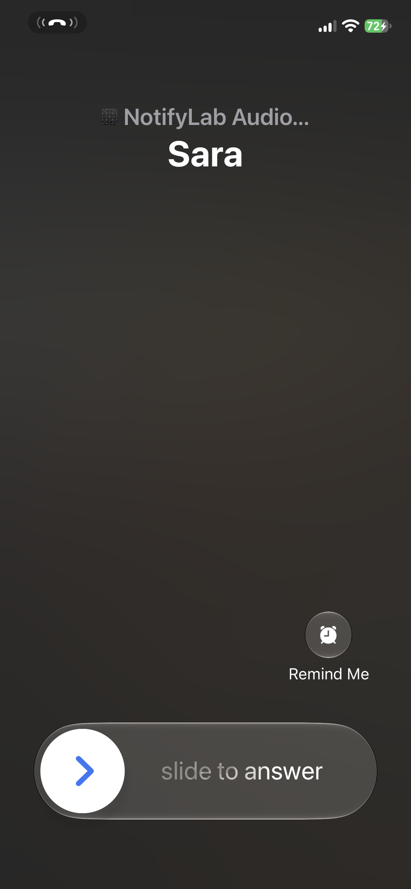

# iOS Notifications, End to End — Part 6: VoIP Calls

*Make the phone ring on a locked screen, even when the app isn't running: PushKit and its separate token, the CallKit rule iOS enforces by ending your app, and what to send when the call is missed.*

---

*This is Part 6 of [iOS Notifications, End to End](https://medium.com/@saadsherif02/ios-notifications-end-to-end-part-0-which-notification-do-you-need-cf3057ad7b9e). New to the series? Start with Part 0, the map.*

A VoIP push is the most powerful push iOS has. It needs no permission, it wakes your app right away, and it launches the app if it isn't running. Apple attached one strict condition to that power: **every VoIP push must become a visible incoming call.** Break the rule and iOS ends your app on the spot.

We're building NotifyLab's **Calls** tab. By the end you'll have:

- A second, separate token for calls, uploaded next to the others
- A VoIP push that shows the full-screen system call UI on a locked iPhone
- Answer and End handled through CallKit
- A clear answer for "missed call" and "caller hung up"


*A real VoIP push to my iPhone. iOS draws the whole screen; the app only supplies the name.*

> Code: `VoIPService.swift` in the [NotifyLab repo](https://github.com/Sa3doola/NotifyLab). The call screen needs an iPhone: on the Simulator the push arrives, but CallKit ends the call at once.

> NotifyLab's call is a fake: it rings, and you can answer and hang up, but no audio flows. Carrying the voice (WebRTC, SIP) is its own topic.

---

## How a call reaches a locked phone

![Fig 5: A VoIP call. The caller taps Call. Your server finds the callee's VoIP token and pushes with push-type voip and topic bundle.voip. APNs delivers to PushKit, which wakes or launches the app and calls didReceiveIncomingPush. The app must report the call to CallKit with reportNewIncomingCall, immediately, for every push. CallKit shows the system call screen, which works on the lock screen. The user answers with CXAnswerCallAction and the call engine connects the audio. One-time setup: PKPushRegistry for .voIP gives a VoIP token for the server, separate from the alert token, with no permission prompt. If you skip the CallKit report, iOS terminates the app, and if you keep skipping it, iOS stops delivering VoIP pushes to your app.](figures/fig5-voip.png)
*Figure 5: the push only wakes the app. The call screen comes from CallKit, and the report to CallKit is not optional.*

Two Apple frameworks split the work:

- **PushKit** receives the push. It has its own token and its own delegate, separate from everything in Parts 3 and 4.
- **CallKit** shows the call. It draws the same full-screen UI the Phone app uses, on the lock screen, with the ringtone and the slider.

VoIP pushes differ from alert pushes in almost every way:

![Comparison of a VoIP push and an alert push. Token: its own from PKPushRegistry, versus registerForRemoteNotifications. Permission: none, versus needed to show anything. apns-push-type: voip versus alert. apns-topic: bundle ID plus .voip, versus the bundle ID. apns-expiration: 0 or a few seconds, versus when the news goes stale. Payload: up to 5 KB versus 4 KB. Wakes your app: yes, and launches it if it isn't running, versus only when tapped. What iOS demands: report an incoming call to CallKit every time, versus nothing. On the iOS 27 Simulator: token and delivery work but CallKit ends the call at once, versus works.](tables/p6-voip-vs-alert.png)
*VoIP push vs alert push. The last two rows are the ones that bite.*

---

## Step 1: Get the VoIP token

You ask PushKit for a VoIP token by creating a `PKPushRegistry` and saying which push type you want. No permission prompt is involved:

```swift
    /// Registering asks for a VoIP token. No permission prompt is involved.
    func start() {
        registry.delegate = self
        registry.desiredPushTypes = [.voIP]
    }
```

The token arrives in a delegate callback, as `Data`, just like the APNs token in Part 3:

```swift
    func pushRegistry(_ registry: PKPushRegistry,
                      didUpdate pushCredentials: PKPushCredentials,
                      for type: PKPushType) {
        tokens?.didReceiveVoIPToken(pushCredentials.token)
    }

    func pushRegistry(_ registry: PKPushRegistry, didInvalidatePushTokenFor type: PKPushType) {
        tokens?.didReceiveVoIPToken(nil)
    }
```

`PushTokenStore` hex-encodes it and uploads it in the same device record as the others (the `voipToken` field from Part 3). Treat it exactly like the APNs token: it can change, and when iOS invalidates it, tell your server.

Two pieces of setup from Part 2 make this work: the **Voice over IP** background mode (`voip` in `UIBackgroundModes`), and the Push Notifications capability. No separate certificate is needed. The `.p8` key signs VoIP pushes too.

I expected the Simulator not to get a VoIP token. On Xcode 27 it does, 80 bytes like its APNs token, and PushKit even delivers real VoIP pushes to it. It's the call screen that doesn't work there (Test it, below).

## Step 2: Report every push to CallKit, first

This is the method iOS watches:

```swift
    func pushRegistry(_ registry: PKPushRegistry,
                      didReceiveIncomingPushWith payload: PKPushPayload,
                      for type: PKPushType,
                      completion: @escaping () -> Void) {
        let caller = payload.dictionaryPayload[PayloadKey.caller] as? String ?? "Unknown caller"
        reportIncomingCall(from: caller)   // FIRST: tell CallKit
        completion()                       // THEN: tell PushKit we're done
    }
```

And this is the report:

```swift
    /// Shows the system incoming-call screen.
    func reportIncomingCall(from caller: String) {
        let uuid = UUID()
        let update = CXCallUpdate()
        update.remoteHandle = CXHandle(type: .generic, value: caller)
        update.localizedCallerName = caller
        update.hasVideo = false

        calls.insert(CallRecord(id: uuid, caller: caller, date: .now, state: "Ringing"), at: 0)
        EventLog.add("Reported call from \(caller) to CallKit", source: "voip")

        provider.reportNewIncomingCall(with: uuid, update: update) { error in
            guard let error else { return }
            Task { @MainActor in self.setState(uuid, "Failed: \(error.localizedDescription)") }
        }
    }
```

Apple's documentation is blunt about the rule. Since iOS 13, if you receive a VoIP push and don't report a call to CallKit, **the system terminates your app**. If you keep doing it, **iOS may stop delivering VoIP pushes to your app at all.** That's why VoIP pushes can't be used for anything but calls anymore: no "silent sync over VoIP", no "wake up and check mail".

So report **first**, inside this method, before anything slow. Don't fetch the caller's photo or open your call server connection before reporting. Report with what the push carries, then update the call once you know more.

About `completion()`: Apple's sample code calls it inside CallKit's callback, after the report finishes. NotifyLab calls it right after asking CallKit to report, and that rang my iPhone in my tests on iOS 27. Either way, the order is what matters: the report starts before `completion()`.

The top line of the call screen, *"NotifyLab Audio"*, is iOS's own label: your app's name plus the call type. The provider is configured once:

```swift
        let configuration = CXProviderConfiguration()
        configuration.supportsVideo = false
        configuration.maximumCallsPerCallGroup = 1
        configuration.supportedHandleTypes = [.generic]
        provider = CXProvider(configuration: configuration)
```

A Swift 6 note: both delegates are declared `@preconcurrency`, because NotifyLab created the registry with `queue: .main` and passed `queue: nil` (the main queue) to the provider. Both frameworks call back on the main thread, so the main-actor conformance is safe.

## Step 3: Answer and end

When the user slides to answer or taps End, CallKit asks your provider delegate to perform the action:

```swift
    func provider(_ provider: CXProvider, perform action: CXAnswerCallAction) {
        setState(action.callUUID, "Answered")
        // Start your audio session / WebRTC connection here.
        action.fulfill()
    }

    func provider(_ provider: CXProvider, perform action: CXEndCallAction) {
        setState(action.callUUID, "Ended")
        action.fulfill()
    }
```

Call `fulfill()` when the action succeeded, or `fail()` if it didn't. A real app connects its audio in the answer action, and starts playing sound only when CallKit says the audio session is ready (`provider(_:didActivate:)`). The Calls tab lists every call with its state, so you can watch these arrive.

## Step 4: Send it

The payload is small. `aps` stays empty, and the rest is yours (`payloads/voip-call.json`):

```json
{
  "aps": {},
  "caller": "Sara",
  "callId": "c-7f3a"
}
```

The headers are what make it a VoIP push. NotifyLab's tools set them for the `voip` type:

```js
    case "voip":
      return { "apns-push-type": "voip", "apns-priority": "10", "apns-topic": `${bundleId}.voip`, "apns-expiration": "0" };
```

- **`apns-push-type: voip`** and the topic **`<bundle ID>.voip`**. I tried getting each wrong: an alert-type push to a VoIP token, and a VoIP push without the `.voip` suffix, both came back `400 DeviceTokenNotForTopic`.
- **`apns-expiration: 0`**: Apple recommends 0 or a few seconds. A call that rings five minutes late is worse than a missed call.
- **Priority 10.** A call is always urgent.

```bash
./tools/apns.sh payloads/voip-call.json voip
```

---

## Missed calls and hang-ups

The rule "every VoIP push is a new call" shapes what you send afterwards:

- **The caller hangs up while it's ringing.** The app is already awake, because PushKit woke it for the call. Tell it through your own call-signaling connection, and end the call with `provider.reportCall(with:endedAt:reason:)` and the reason `.remoteEnded`. If you use a second VoIP push for this instead, the rule still applies: the app must report a call for it, then end it immediately.
- **The call was missed.** Send a **regular alert push**: "Missed call from Sara". To show the caller's photo, use the communication-notification technique from Part 5 with an `INStartCallIntent` instead of a message intent, and add `INStartCallIntent` to `NSUserActivityTypes` next to `INSendMessageIntent`.
- **Answered on another device.** Stop the ringing on this one the same way as a hang-up, through your signaling connection.

---

## Test it

**1. Get the token (iPhone).** Run NotifyLab on your iPhone and open **Calls**. Copy the VoIP token into `VOIP_TOKEN` in `tools/.env`.

**2. Ring the phone.** Lock the iPhone and send:

```bash
./tools/apns.sh payloads/voip-call.json voip
```

The full-screen call from *Sara* appears on the lock screen. Answer it or decline it, then open **Calls**: the call is listed as *Answered* or *Ended*.

**3. Ring it without a push.** In **Calls**, tap **Show an incoming call now**. It calls the same `reportIncomingCall` the push handler uses, which is handy when you're working on the call UI.

**4. Try the Simulator, to see the limit.** The Calls tab shows a VoIP token there too. Send the same push to it, and the Status tab's log shows *Reported call from Sara to CallKit*: PushKit delivered it, and the app did its part. But CallKit ends the call immediately and no call screen appears. The button in step 3 does the same thing on the Simulator. Use a device for anything you need to see.

**5. The case PushKit is for.** Swipe NotifyLab away in the app switcher, lock the phone, and send the push again. The call should still ring: PushKit launches the app in the background just long enough to report it.

---

## Production notes

- **VoIP pushes are for calls only.** Every one must show a call. Anything else belongs in an alert or silent push (Part 4).
- **Report first, fetch later.** Call `reportNewIncomingCall` before any network request. Update the call with a photo or better name afterwards.
- **Use your call ID for the CallKit UUID.** NotifyLab makes a fresh `UUID()` for each push. A real app should derive it from the server's `callId`, so a duplicate push for the same call doesn't ring twice, and a hang-up can find the right call.
- **Expire calls fast.** `apns-expiration: 0` (or a few seconds) and priority 10.
- **Keep the VoIP token fresh** like the APNs token: upload it when it changes, clear it when iOS invalidates it (Part 3).
- **Plan for mainland China.** Chinese regulators have required CallKit to be switched off for users in mainland China since 2018, and without CallKit you can't use VoIP pushes at all. The usual fallback there is a regular alert push, often time-sensitive, that opens your own call screen when tapped.
- **Send missed calls as alerts**, ideally as communication notifications with an `INStartCallIntent`, so they show the caller's face.
- **Start audio when CallKit says so**, in `provider(_:didActivate:)`, not when you think the call starts.

**Next: Part 7, Real-world delivery.** Why a push that APNs accepted never showed up: Focus, the Scheduled Summary, Low Power Mode, offline phones and interruption levels. Plus every testing tool, from dragging a file onto the Simulator to Apple's Push Notifications Console and Delivery Log.
