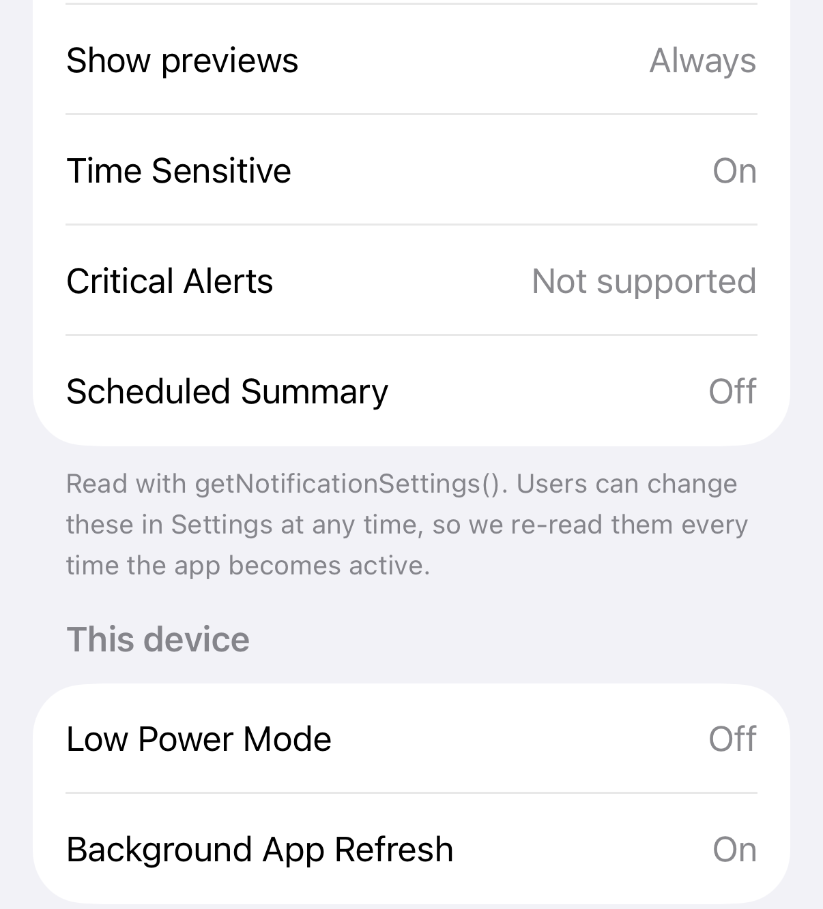
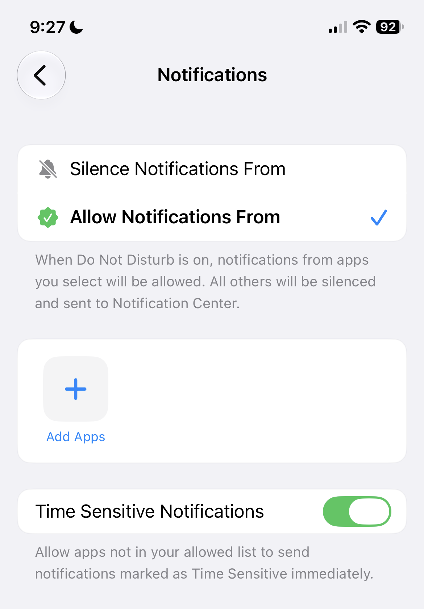
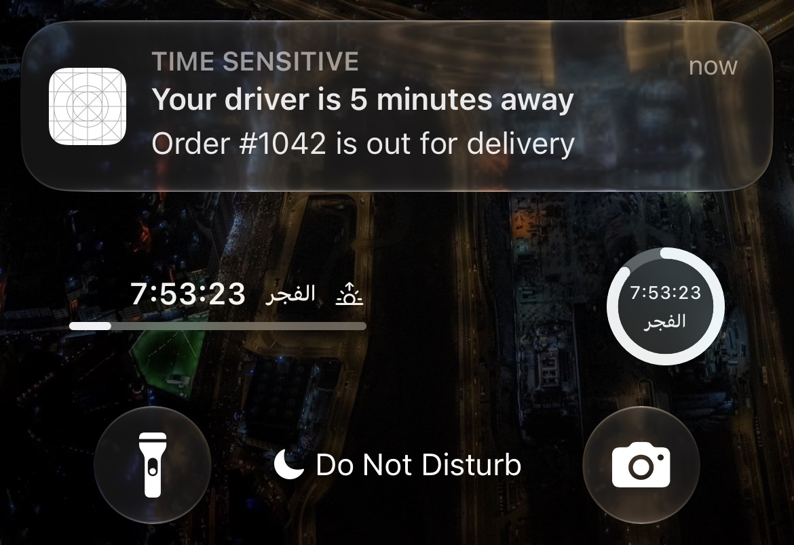
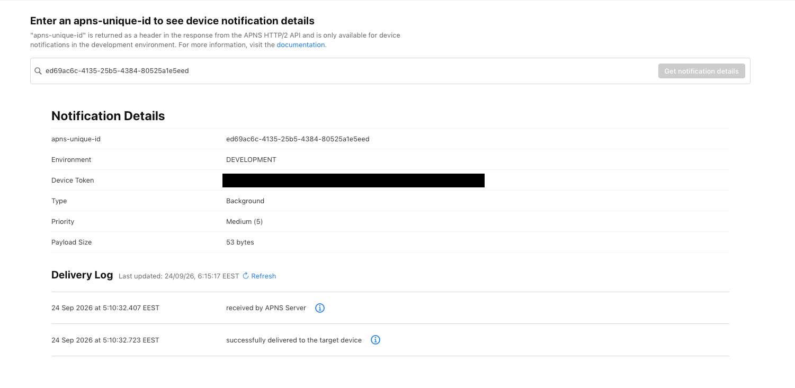

# iOS Notifications, End to End — Part 7: Real-World Delivery

*Why a push that APNs accepted never showed up: the seven checks between "sent" and "seen", Focus and the Scheduled Summary, Low Power Mode, offline phones, and every tool that shows you where a notification stopped.*

---

*This is Part 7 of [iOS Notifications, End to End](https://medium.com/@saadsherif02/ios-notifications-end-to-end-part-0-which-notification-do-you-need-cf3057ad7b9e). New to the series? Start with Part 0, the map.*

Part 0 started with the most common notification problem: **the notification never shows up.** Every part since then built one piece of the path. This one is about the moment it breaks anyway. APNs said `200`, your logs look fine, and the user says *"I never got it."*

A `200` only means APNs accepted the request. Between that and a banner on the screen are seven checks, some on Apple's servers and most on the phone. Each one can hold a notification back, delay it, or show it quietly, and none of them tells your server.

By the end you'll be able to:

- Name the seven checks, and which of them your code controls
- Predict what Focus, the Scheduled Summary and Low Power Mode will do to each kind of push
- Use every testing tool, from dragging a file onto the Simulator to Apple's Delivery Log
- Walk a missing notification back to the exact check that stopped it

> Code: `StatusView.swift` and `NotificationPermission.swift` in the [NotifyLab repo](https://github.com/Sa3doola/NotifyLab). The Status tab shows most of what this part talks about, live.

---

## Seven checks between "sent" and "seen"

![Fig 7: Seven checks between sent and seen. 1, provider to APNs or FCM: rejected with 400, 403, 410, 413 or 429; log the apns-id, handle each error, delete dead tokens. 2, device offline: APNs keeps one notification per app, the newest, until apns-expiration; use apns-collapse-id and fetch current state on app open. 3, power and priority: Low Power Mode or priority 5 means batched and delayed; use priority 10 only for things the user needs now. 4, app state, silent pushes only: force-quit, Background App Refresh off or budget used up means not delivered; treat a silent push as a hint and sync on launch. 5, user permission: denied shows nothing, provisional goes to Notification Center only; read the settings, show in-app fallbacks, offer a deep link to Settings. 6, Focus and Summary: silenced or batched; choose the right interruption level, set relevance-score, use communication notifications for real people. 7, app in foreground: nothing shows unless willPresent returns banner, list and sound, or the app updates its UI.](figures/fig7-delivery-checks.png)
*Figure 7: the seven checks, in the order a push meets them.*

The first check happens on your server, the second on Apple's, and the other five on the phone. Parts 2 to 6 covered most of them in passing. Here they are in one place:

1. **Your server → APNs or FCM.** A `400`, `403`, `410`, `413` or `429` means it never left. Part 2's error table and Part 3's cleanup handle these.
2. **The phone is offline.** APNs keeps **one** notification per app while the phone is off, usually the newest, until `apns-expiration` (at most 30 days). Five order updates sent overnight become one in the morning. With collapse IDs (Part 4) that's what you want. For a chat app, it means the app must fetch missed messages when it opens.
3. **Power and priority.** Priority 5 pushes are delivered when it suits the battery, and Low Power Mode makes iOS more careful still. The Delivery Log (below) tells you when APNs held a push back for the device's power state.
4. **The app's state.** Silent pushes only. A force-quit app, Background App Refresh switched off, or a used-up background budget, and the silent push never wakes the app (Part 4).
5. **Permission.** Denied means nothing shows. Provisional means Notification Center only. And even "allowed" is several separate switches the user can flip: banners, sounds, lock screen, previews and more.
6. **Focus and the Scheduled Summary.** The notification arrives, and iOS keeps it quiet or saves it for later. The next section is about this one.
7. **The app is open.** Without `willPresent`, nothing shows at all (Part 1).

Checks 3 to 7 are the ones your server can't see. NotifyLab's Status tab reads them from the device:


*The Status tab re-reads all of this every time the app becomes active, and when Low Power Mode changes.*

*Critical Alerts: Not supported* is the honest answer here: critical alerts need an entitlement Apple grants on request, and NotifyLab doesn't have one.

---

## Interruption levels, Focus and the Scheduled Summary

Part 1 introduced interruption levels. Here's the full picture, including what each one needs:

![Fig 6: Interruption levels from quiet to wake-the-house. Passive: no sound, doesn't light up the screen, never breaks through Focus, needs nothing, for tips, weekly recaps and marketing. Active, the default: sound, lights up the screen, breaks through Focus only if the user allows your app, needs nothing, for order updates, habit reminders and messages. Time-sensitive: sound, lights up the screen, breaks through Focus if the user allows time-sensitive notifications, skips the Scheduled Summary, needs the Time Sensitive Notifications capability, for a driver arriving or an account security alert. Critical: sound even when muted, breaks through everything, needs an entitlement approved by Apple plus the .criticalAlert permission, for glucose, home or public-safety alarms.](figures/fig6-interruption-levels.png)
*Figure 6: pick the lowest level that still does the job.*

**Focus** (Do Not Disturb, Sleep, Work…) is the user's filter, not yours. In each Focus the user picks which people and apps may notify them, and whether **time-sensitive** notifications may break through. So:

- An **active** notification from an app the user didn't allow waits quietly in Notification Center until the Focus ends.
- A **time-sensitive** one gets through, if the user left *Time Sensitive Notifications* on for that Focus. They can turn it off, per Focus and per app.
- A **communication notification** (Part 5) gets through if the *person* is allowed in that Focus.
- A **critical** alert gets through everything, with sound, even on silent. That's why Apple approves the entitlement by hand, for things like medical and home-safety alarms.


*Do Not Disturb with no apps allowed, and time-sensitive notifications let through. iOS describes the rule in its own words under the switch.*


*The same Focus, a moment later: NotifyLab isn't on the allowed list, but its time-sensitive order update lit up the lock screen anyway.*

The **Scheduled Summary** is a digest the user sets up: notifications from the apps they choose are held and delivered together, at the times they pick. Time-sensitive notifications and communication notifications skip it and arrive right away. Inside the summary, iOS sorts by `relevance-score` (0 to 1), which is why NotifyLab's marketing push says `0.2` and the out-for-delivery push says `1.0`.

Two practical rules follow:

- **Earn "time-sensitive".** Users can switch it off for your app in one tap, and once they have, your genuinely urgent pushes wait like everything else. The Status tab's *Time Sensitive* row tells you if they did.
- **Don't fight the filters.** Apps can also adapt their *content* to a Focus with Focus filters (an App Intents feature), but they can't get around the user's choice of who may interrupt them.

---

## Low Power Mode, and phones that are off

**Low Power Mode** cuts background work. Silent pushes can wait until later, and priority-5 pushes can be held back. A priority-10 alert the user needs now still comes through. NotifyLab's Status tab shows the current state, and updates it the moment the user switches Low Power Mode on or off.

**Background App Refresh**, when switched off for your app, means silent pushes don't wake it at all. The Status tab says so in plain words: *"Off (silent pushes won't wake the app)"*.

**An offline phone** gets one notification per app when it comes back, usually the newest, and only if `apns-expiration` hasn't passed. Design for it: make every notification make sense on its own, collapse state updates, and let the app fetch what it missed.

---

## The testing toolkit

No single tool tests everything. Here's what each one can and can't do, from what I measured with Xcode 27 and iOS 27:

![Table of testing tools. Dragging an .apns file onto the Simulator or simctl push: the Service Extension doesn't run, silent pushes are refused, no VoIP; best for text, buttons, grouping and deep links with no account. A real sandbox push to the Simulator: the Service Extension runs but no thumbnail is drawn, a silent push gets 200 but the app isn't woken, a VoIP push is delivered but the call is ended at once; best for Service Extension logic without a device. A real push to an iPhone: everything works; the only complete test. curl or Postman over HTTP/2, the Push Notifications Console, and Firebase's Send test message behave like the device you send to; best for sharing requests, quick browser sends, and checking the FCM to APNs link. The Delivery Log answers whether APNs delivered it, sandbox only. log stream or Console.app answers whether the phone received it.](tables/p7-test-tools.png)
*Every tool, and where it stops. The iPhone row is the only one with no caveats.*

### 1. Drag and drop, or `simctl push`

The fastest loop. Drag any file from `payloads/` onto the Simulator window, or:

```bash
xcrun simctl push booted payloads/order-shipped.apns
```

It needs no account, key or server, which makes it perfect for checking text, buttons, grouping and deep links. The `"Simulator Target Bundle"` key in each payload tells the Simulator which app it's for, so you don't have to type the bundle ID. The limits are real, though. It never runs the Service Extension, it refuses silent payloads (*"no user visible content"*), and before the user allows notifications it fails with *"Source is not authorized"*.

### 2. A real sandbox push to the Simulator

Since Xcode 14 on Apple silicon (or T2) Macs, the Simulator gets a real APNs token, so `tools/apns.sh` works against it. This path **does** run the Service Extension. It still can't draw thumbnails, and silent and VoIP pushes stop short: APNs accepts them, but the silent one doesn't wake the app, and CallKit ends the call at once.

It's also not a guaranteed channel. While writing this part, three pushes in a row got `200` from APNs and never reached the Simulator: `apsd` logged nothing, and neither did the app. The same payload had arrived ten minutes earlier. I never found out why. The Delivery Log would have been my next step, which is exactly what this part is about.

### 3. A real iPhone

The only complete test. Everything in this series that says "verified" was verified here: images, the order card, silent wake-ups, the driver's photo, the ringing call.

### 4. curl and Postman

`tools/apns.sh` *is* the curl version (Part 4). For people who prefer a GUI, `tools/NotifyLab.postman_collection.json` has the same requests: three APNs sends (order, marketing, silent) and one through FCM. Two things to set up:

- **HTTP/2.** APNs refuses HTTP/1.1. In Postman, set the request's HTTP version to HTTP/2 in its Settings.
- **The JWT.** Run `node tools/jwt.mjs` and paste the result into the collection's `jwt` variable. It stays valid for an hour (Part 2).

### 5. The Push Notifications Console

Apple's browser tool at **icloud.developer.apple.com → Push Notifications**, also one click away from the Push Notifications capability in Xcode. The **Send** tab is a form for every header in Part 4:


*The Console's Send form. "Get cURL Command" turns the form into a curl request, like the one `apns.sh` makes.*

It's handy for a quick check from a machine without your tools, and for showing a teammate exactly which headers matter.

### 6. The Delivery Log

This is the tool that answers *"did Apple deliver it?"*. Every sandbox response includes an `apns-unique-id` header (Part 2's `apns.sh` prints it). Paste it into the Console's **Delivery Log** tab:


*The silent push from Part 4: APNs received it, and delivered it to my iPhone 316 milliseconds later.*

If the log says *delivered* and the user saw nothing, the problem is on the phone: checks 4 to 7. If it never says delivered, the push is stuck before the phone (offline, or held back), and the log shows how far it got. The catch: it only works for the **development** environment. For production pushes, your own logs of `apns-id` and status are all you have.

### 7. Firebase "Send test message"

In the Firebase console, **Messaging → New campaign → Notifications**, write a title and text, then **Send test message** and paste an FCM token. If that arrives and your server's sends don't, the problem is in your server. If it doesn't arrive either, check the APNs key uploaded to Firebase (Part 3).

### 8. The phone's own logs

When nothing else explains it, ask the phone. Pushes arrive through a system process called `apsd`. On the Simulator you can watch it live:

```bash
xcrun simctl spawn booted log stream --level debug --predicate 'process == "apsd"' | grep "Received message for"
```

When a push for your app arrives, you'll see a line like this (shortened):

```
apsd: Received message for enabled topic 'com.yourco.notifylab' … with payload '{"aps":{…}}'
```

For an iPhone, open **Console.app** on your Mac, select the iPhone in the sidebar, click **Start**, and search for `apsd` plus your bundle ID. And NotifyLab's own event log (Status tab) shows what the app and its extensions did with the push once it arrived.

---

## Test it: walk a missing notification back

When a push "didn't arrive", go through the checks in order, and stop at the first one that fails:

1. **Send it yourself** with `./tools/apns.sh`. Note the status and the `apns-unique-id`.
2. **Not `200`?** It never left your server. Use Part 2's error table.
3. **`200`?** Paste the `apns-unique-id` into the **Delivery Log**. Not delivered: the phone was offline, or APNs held it back for power (check 2 or 3).
4. **Delivered, but nothing on screen?** Open NotifyLab's **Status** tab. Is it allowed? Are banners on? Is *Time Sensitive* off? Is the app in the Scheduled Summary?
5. **Is a Focus on?** Check whether NotifyLab is allowed in it, and whether time-sensitive notifications may break through.
6. **Was the app open?** The event log says *Arrived in foreground* if `willPresent` ran.
7. **A silent push?** Check Low Power Mode, Background App Refresh, and whether the app was swiped away.

Then try the filters on purpose, so you've seen each one once:

- **Focus.** Turn on a Focus that doesn't allow NotifyLab but allows time-sensitive notifications. Send `order-shipped.apns` (active) and `order-out-for-delivery.apns` (time-sensitive), with the phone locked. Only the second should interrupt you. When I ran it under Do Not Disturb, the out-for-delivery push lit up the lock screen with its *Time Sensitive* label (the screenshot above). Lock the phone first: my first try at the shipped push arrived while NotifyLab was open, and then `willPresent` decides, not the Focus.
- **Scheduled Summary.** Add NotifyLab to the Scheduled Summary, and send the same two. The shipped update should wait for the summary; the out-for-delivery one shouldn't.
- **Offline.** Turn on Airplane Mode, send three order updates, then turn it off. Only one should arrive, usually the last.

---

## Production notes

- **Log every send.** Store the `apns-id`, the status, the environment and a short hash of the token. When a user complains, that's the only trace of a production push you'll have.
- **Measure what you can.** APNs never tells you a notification was *shown*. Count opens yourself: when the user taps, the app reports it.
- **Keep time-sensitive for time-sensitive things.** Users turn it off for the whole app, and then nothing you send breaks through.
- **Design every notification to stand alone.** Offline phones get only the newest; Focus and the Summary reorder the rest. Collapse state updates, expire stale news, and fetch the real state on launch.
- **Keep one test device per environment.** A Debug build tests sandbox; a TestFlight build tests the production path your users are on.
- **Don't debug on the Simulator alone.** It's great for layout and logic, and it lies about images, silent pushes and calls.

**Next: the appendix.** One page to bookmark: every limit, header and error code from this series, and the checklist to run before you ship.
